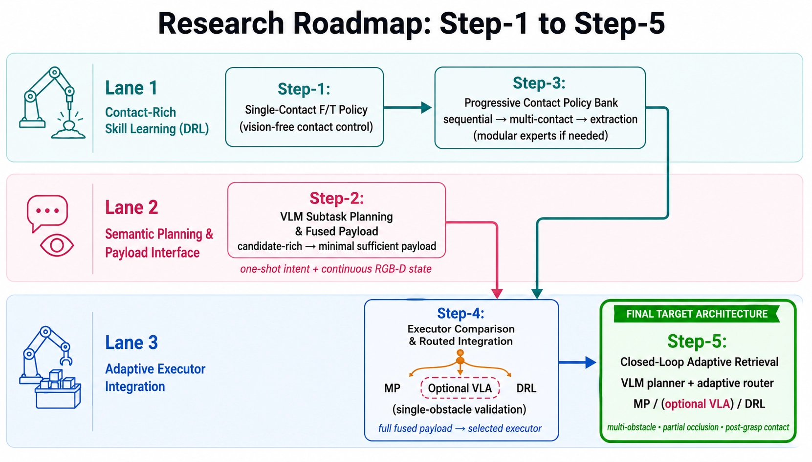
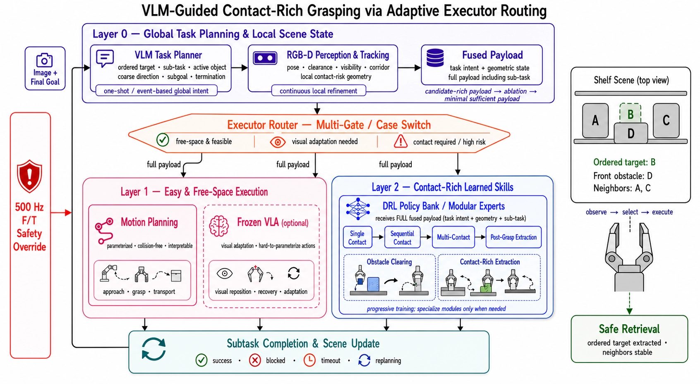

# VLM Subtask·Fused Payload 기반 Adaptive Executor Routing 프로토콜

> 원본: [Notion 페이지](https://app.notion.com/p/3ad952c9e2738076a888f68b0043f39f)
> 내보낸 날짜: 2026-08-01



이 그림이 이 문서의 전체 연구 로드맵을 나타낸다. 오른쪽 끝의 **Step-5가 최종 목표 아키텍처**이며, 왼쪽의 Step-1부터 Step-4는 이를 구현하기 위해 순차적·병렬적으로 확보해야 하는 구성요소다.
연구는 두 갈래로 병렬 진행된다. **Lane 1은 F/T 기반 contact-rich DRL skill을 단일접촉에서 순차·다중접촉 및 grasp 후 추출까지 단계적으로 확장**하고, **Lane 2는 VLM 기반 subtask 생성과 RGB-D 기하 정보를 결합한 fused payload interface를 구축**한다. 두 연구 라인은 Lane 3의 **Step-4에서 합류**하여, Motion Planning·선택적 VLA·DRL 중 적절한 실행기를 선택하는 adaptive routing 구조로 통합된다.
Step-4에서는 VLM이 생성한 subtask에 대해 Motion Planning만으로 충분한지, Frozen VLA가 추가적인 이점을 제공하는지를 비교한다. 따라서 VLA는 고정된 필수 구성요소가 아니라 실험 결과에 따라 포함 여부를 결정하는 선택적 실행기다. 최종적으로 Step-5에서는 이 구조를 다중 장애물, 부분 가림 및 grasp 후 접촉이 발생하는 환경으로 확장하여 closed-loop target retrieval을 수행한다.

## 단계 명명

| Step | 이름 | 한 줄 정의 | 새로 확보하는 능력 |
| --- | --- | --- | --- |
| **Step-1** | **Single-Contact F/T Policy** | 접촉 구간에서 카메라 없이 F/T와 고유수용감각을 사용하여 단일 물체와의 접촉을 안정적으로 제어하는 정책 | Vision-free contact control의 기반 |
| **Step-2** | **VLM Subtask Planning & Fused Payload** | VLM이 ordered target, active object, subtask 및 대략적인 행동 방향을 생성하고, 이를 RGB-D 기하 정보와 결합하여 fused payload로 구성 | Semantic subtask planning과 payload interface |
| **Step-3** | **Progressive Contact Policy Bank** | Single-contact 정책을 순차접촉, 다중접촉 및 grasp 후 contact-rich extraction으로 단계적으로 확장하고, 필요한 경우 별도 expert policy를 추가 | 복잡도별 contact skill과 modular policy 구성 |
| **Step-4** | **Executor Comparison & Routed Integration** | Fused payload와 subtask를 기반으로 Router가 Motion Planning·선택적 Frozen VLA·DRL 중 적절한 실행기를 선택하며, 단일 장애물 환경에서 통합 성능을 검증 | VLA 필요성 검증과 adaptive executor routing의 최소 구현 |
| **Step-5** | **Closed-Loop Adaptive Retrieval (최종)** | VLM의 global subtask와 연속 갱신되는 RGB-D 상태를 기반으로 실행기를 반복 선택하여 다중 장애물·부분 가림·grasp 후 접촉 환경에서 ordered target을 안전하게 회수 | 반복 subtask 계획, adaptive routing 및 closed-loop s |

## **1. 최종 아키텍처 (Step-5)**



### 1.0 역할 분담 — Iterative Handoff에서 Adaptive Executor Routing으로

기존 구조에서는 Frozen VLA가 장면을 보고 접근·재배치·grasp을 판단하고, 접촉 위험이 감지될 때마다 단일 DRL 정책으로 제어권을 넘겼다. 현재 구조에서는 **VLM이 ordered target과 현재 필요한 subtask를 명시적으로 생성**하고, semantic task intent와 RGB-D geometric state를 결합한 fused payload를 기반으로 **Executor Router가 적절한 실행기를 선택**한다.

### 1.1 그림 읽기

현재 시스템은 모든 계층이 동시에 로봇을 제어하는 구조가 아니다. **VLM은 저주기 또는 event 기반으로 global subtask를 생성하고, RGB-D perception은 local geometry를 연속적으로 갱신한다. 이후 Executor Router가 현재 subtask와 장면 상태에 적합한 실행기 하나를 선택한다.**

- **Image + Final Goal** — 시스템은 현재 RGB-D 관측과 자연어로 주어진 최종 목표를 입력받는다.
- **VLM Task Planner** — VLM은 장면 전체를 보고 ordered target을 식별한 뒤, 현재 수행해야 할 큰 단위의 행동 의도를 생성한다. 출력에는 `subtask`, `active_object`, `coarse_direction`, `subgoal`, `termination_condition` 등이 포함된다. VLM은 매 제어 step마다 실행되는 것이 아니라 에피소드 시작, subtask 완료, 실행 실패 또는 의미 있는 장면 변화가 발생했을 때 새로운 subtask를 생성한다.
- **RGB-D Perception & Tracking** — RGB-D perception은 VLM의 global intent와 별도로 target 및 주변 물체의 pose, clearance, visibility, corridor, contact-risk geometry를 연속적으로 추정한다. VLM이 “어떤 물체를 어느 방향으로 조작해야 하는가”라는 큰 그림을 제공한다면, RGB-D perception은 이를 실제 로봇 제어에 필요한 metric geometry로 보완한다.
- **Fused Payload** — VLM이 생성한 task intent와 RGB-D가 계산한 geometric state를 하나의 구조화된 payload로 결합한다. Fused payload에는 ordered target, 현재 subtask, active object, coarse direction, subgoal, 종료 조건 및 local geometry가 포함된다. 이 payload는 Layer 1과 Layer 2 모두에 전달되며, 선택된 실행기가 현재 행동에 필요한 항목을 사용한다.
- **Executor Router — Multi-Gate / Case Switch** — Router는 fused payload와 현재 장면 상태를 이용해 Motion Planning, optional VLA 또는 DRL 중 실제로 로봇을 제어할 실행기 하나를 선택한다. 하나의 `Gate 1`만 사용하는 것이 아니라 여러 조건을 case-switch 방식으로 평가한다.
	- **Free-space이며 실행 가능성이 명확한 경우** → Motion Planning
	- **명시적인 trajectory로 표현하기 어렵고 시각적 적응이 필요한 경우** → optional Frozen VLA
	- **접촉이 필요하거나 contact risk가 높은 경우** → DRL Policy Bank
- **Layer 1 — Easy & Free-Space Execution** — Layer 1에는 Motion Planning과 optional Frozen VLA가 병렬적인 실행 후보로 존재한다.
	- **Motion Planning**은 target pose와 목표 상태가 명확한 접근, grasp 및 자유공간 transport를 수행한다.
	- **Frozen VLA**는 Motion Planning으로 행동을 명확히 파라미터화하기 어렵거나 visual reposition, recovery 및 online visual adaptation이 필요한 경우에만 선택된다.
	두 실행기는 순차적으로 연결된 것이 아니며, Router가 둘 중 하나를 선택한다. Motion Planning만으로 충분한 성능을 얻는다면 VLA는 최종 시스템에서 제외할 수 있다.
- **Layer 2 — Contact-Rich Learned Skills** — Layer 2의 DRL은 접촉이 필요한 subtask를 담당하며, task intent와 geometry를 포함한 전체 fused payload를 입력받는다. 정책은 single-contact에서 시작하여 sequential contact, multi-contact 및 post-grasp extraction으로 점진적으로 확장된다. 하나의 공유 정책으로 모든 조건을 처리하기 어려운 경우에는 subtask 또는 접촉 복잡도에 특화된 별도 expert policy를 추가한다.
- **Subtask Completion & Scene Update** — 선택된 실행기가 행동을 종료하면 결과를 `SUCCESS`, `BLOCKED`, `TIMEOUT` 또는 `REPLANNING`으로 구분한다. 이후 갱신된 장면을 바탕으로 현재 subtask를 계속할지, 새로운 subtask를 생성할지, 다른 실행기로 전환할지를 결정한다.
- **500 Hz F/T Safety Override** — 안전 계층은 Motion Planning, VLA 및 DRL보다 높은 우선순위로 독립적으로 동작한다. 위험 수준의 외력이 감지되면 현재 선택된 실행기와 subtask에 관계없이 로봇을 즉시 정지하거나 안전 동작으로 전환한다.

### 1.2 이 구조가 필요한 이유 — 대상 시나리오

목표 물체 B의 좌·우에는 A와 C가 있고, 전면 장애물 D가 B를 부분적으로 가린다. B를 안전하게 회수하려면 장애물 제거, grasp, contact-rich extraction 및 자유공간 이동처럼 서로 다른 특성의 subtask를 순차적으로 수행해야 한다.

```text
① VLM: MOVE_BLOCKER(D)
   → Router: DRL Single-Contact

② Scene Update 후 C가 여전히 방해
   → Router: DRL Sequential/Multi-Contact

③ VLM: GRASP(B)
   → Router: Motion Planning 또는 optional VLA

④ VLM: EXTRACT(B)
   → 접촉 위험 없음: Motion Planning
   → 접촉 위험 있음: DRL Post-Grasp Extraction

⑤ VLM: TRANSPORT(B, safe_area)
   → Router: Motion Planning
```

1. Subtask마다 적합한 실행기가 다르다.
2. 장애물 이동 후 pose·clearance·visibility가 변하므로 scene update가 필요하다.
3. 접촉 복잡도에 따라 single·sequential·multi-contact policy를 선택해야 한다.

따라서 현재 method는 기존의 고정된 VLA–DRL handoff가 아니라, **VLM subtask 생성 → Executor Router 선택 → 실행 → Scene Update**가 반복되는 closed-loop 구조다.

### 1.3 루프 주기 구조 — Global intent는 event 기반, local state는 연속 갱신

현재 구조는 모든 모듈이 동시에 같은 속도로 실행되는 방식이 아니다. VLM은 필요한 시점에 subtask를 생성하고, RGB-D perception과 안전 계층은 연속 실행된다. Router는 갱신된 payload와 실행 결과를 바탕으로 실행기를 다시 선택한다.

| 구분 | 구성요소 | 실행 방식 | 주기 |
| --- | --- | --- | --- |
| **Global planning** | VLM Task Planner | 에피소드 시작, subtask 완료, `BLOCKED`, `TIMEOUT` 또는 replanning 필요 시 실행 | Event-based |
| **Local perception** | RGB-D Perception & Tracking | Pose, clearance, visibility 및 corridor를 연속 갱신 | 약 15 Hz |
| **Executor routing** | Multi-Gate / Case Switch Router | Fused payload와 contact risk를 평가해 실행기 선택 | Event-based 또는 10–20 Hz |
| **Layer 1** | Motion Planning / optional VLA | Motion Planning은 subtask별 실행, VLA는 선택된 경우에만 동작 | MP: subtask별 / VLA: 10–20 Hz |
| **Layer 2** | DRL Policy Bank | Full fused payload를 받고 F/T·고유수용감각으로 contact action 수행 | 50–100 Hz |
| **Safety** | F/T Safety Override | 선택된 실행기와 관계없이 항상 최우선 | 500 Hz |

VLM이 생성한 global subtask는 해당 subtask가 종료될 때까지 유지되고, RGB-D geometric state는 그동안 계속 갱신된다. 선택된 실행기가 `SUCCESS`, `BLOCKED` 또는 `TIMEOUT`을 반환하면 Router가 장면을 다시 평가하고, 필요하면 VLM이 다음 subtask를 생성한다.
