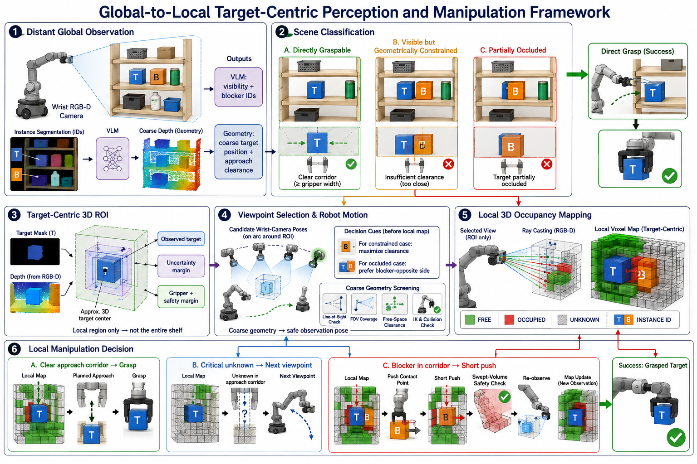
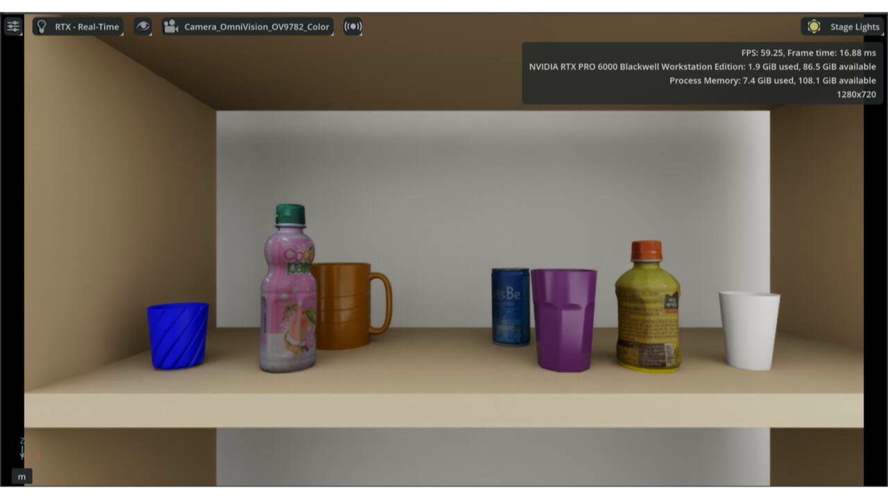
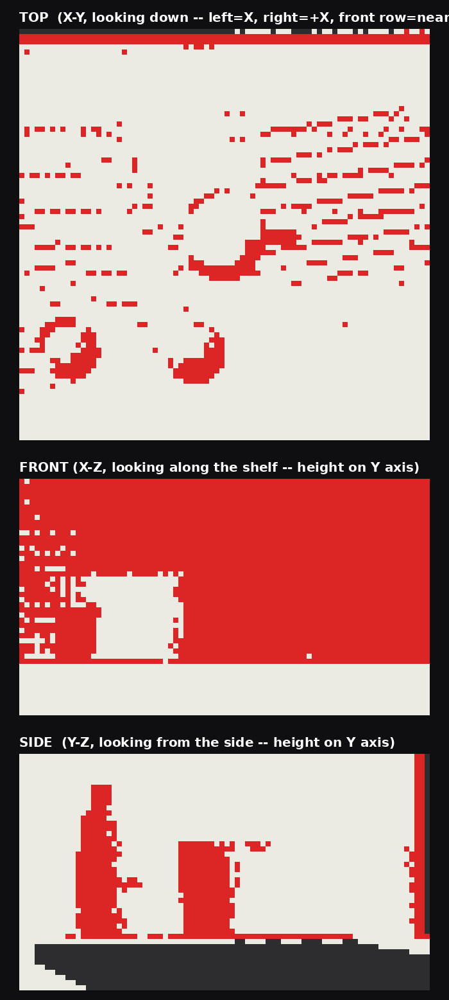
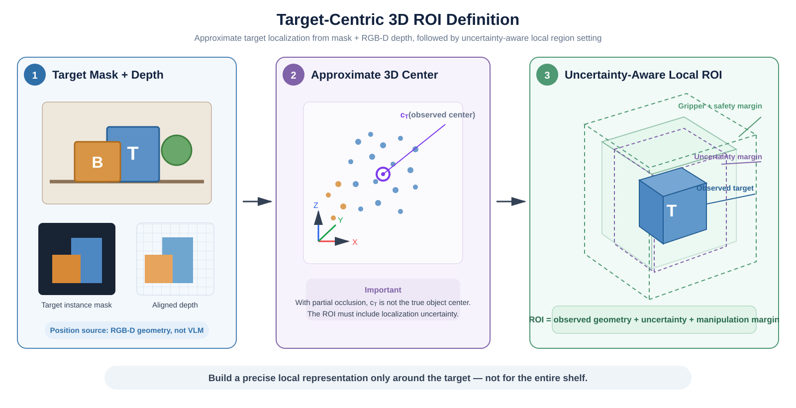
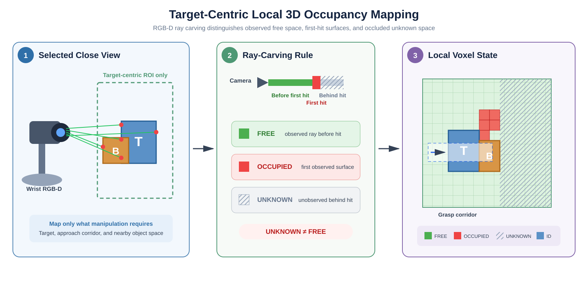

# Global-to-Local Target-Centric Perception and Manipulation Framework

> 원본: [Notion 페이지](https://app.notion.com/p/3b4952c9e27380f3b3f8d89274e0f513)
>
> 내보낸 날짜: 2026-08-06



> 🎯 **핵심 아이디어:** 멀리서 전체 장면을 파악한 뒤, 직접 grasp가 어려운 경우에만 target 주변을 가까이 관측하여 **local 3D occupancy map**을 생성한다. 전체 선반의 정밀 map을 만드는 것이 아니라, 조작에 필요한 target 주변 영역만 정밀하게 표현한다.

## 현재 실험 진행 상황 (2026-08-06)

> ✅ **현재 완료 범위:** ① 40개 Scene의 VLM 기반 target 가려짐 판단·blocker 식별 평가, ② 단일 simulation scene의 주황색 mug를 대상으로 한 target-centric local 3D occupancy map 생성 및 시각화.

### A. Global Semantic Perception 평가

- **가려짐 판단:** In-scope인 Level 1·3·4에서 **30/30 (100%)** 정확. 스키마 밖의 타이트 인접 장면인 Level 2에서는 **8/10 정확, 2/10 오판**.
- **Blocker 식별:** 실제 가려짐이 있는 Level 3·4 총 20개 Scene에서 **20/20 (100%)** 정답 blocker와 일치.
- **완료 의미:** 멀리서 촬영한 instance-overlay 이미지로 target의 가려짐 여부와 가리는 물체를 식별하는 semantic perception 단계까지 평가 완료.
- **상세 결과:** [40개 Scene 가려짐 판단 + 블로커 식별 평가 결과 (2026-08-06)](https://app.notion.com/p/3b4952c9e2738109876fc4200606e7a5)

### B. Target-Centric Local 3D Occupancy Mapping 구현

- **실험 장면:** 선반 위 여러 물체 중 **주황색 mug를 target**으로 설정.
- **Map 범위:** 전체 선반이 아니라 주황색 mug와 인접 물체가 포함되는 target 주변 local 3D region으로 제한.
- **출력:** 생성된 3D occupancy를 **TOP (X–Y), FRONT (X–Z), SIDE (Y–Z)** 방향으로 투영하여 target과 주변 관측 geometry를 시각화.
- **현재 의미:** 단일 Scene에서 local map 생성 파이프라인이 동작하고 결과를 시각화하는 단계까지 완료.



*실험 장면. 주황색 mug를 target으로 설정하고 주변 local region의 3D occupancy를 생성함.*



*주황색 mug 주변 local 3D occupancy map의 TOP·FRONT·SIDE 투영 결과.*

> ⚠️ **아직 검증되지 않은 부분:** 현재 결과는 단일 Scene의 구현·시각화 결과이다. FREE–OCCUPIED–UNKNOWN 분류 정확도, target·주변 instance 분리 정확도, false-free rate, multi-view update 및 여러 Scene에 대한 정량 평가는 아직 필요하다.

### 다음 구현·평가 항목

- RGB-D geometry 기반 접근 여유 계산 및 target-centric 3D ROI 자동 설정
- Blocker 반대편 viewpoint 선택과 실제 robot arm/camera 이동
- 여러 Scene에서 local 3D occupancy map 정량 평가
- Local map 기반 grasp / next viewpoint / short push 의사결정과 closed-loop 검증

## 1. Distant Global Observation

멀리 떨어진 위치에서 RGB-D camera로 전체 선반을 관측한다.

- **Instance segmentation:** Target과 주변 물체에 Instance ID 부여
- **VLM:** Target 가시성, occlusion 여부, occluding blocker ID 판단
- **RGB-D geometry:** Target의 대략적인 3D 위치와 접근 공간의 여유 계산
- **중요:** VLM은 target–blocker의 좌우·거리 관계를 계산하지 않는다. 공간 관계는 mask와 depth로부터 계산한다.

## 2. Scene Classification

| 상황 | 정의 | 다음 행동 |
| --- | --- | --- |
| **Directly Graspable** | Target이 충분히 보이고 gripper-width 접근 corridor가 확보됨 | Direct grasp |
| **Visible but Geometrically Constrained** | Target은 보이지만 주변 물체가 너무 가까워 접근 여유가 부족함 | Target-centric ROI 설정 |
| **Partially Occluded** | 다른 instance가 target의 일부를 가림 | Target-centric ROI 설정 |

> **Free의 의미:** Target이 영상에 보이는 것만으로는 부족하다. 유효한 grasp pose와 collision-free approach corridor가 모두 확보되어야 한다.

## 3. Target-Centric 3D ROI

Target이 Visible but Geometrically Constrained 또는 Partially Occluded이면 target mask 내부의 depth를 3D로 변환하여 관측 중심을 계산한다.

$$
\mathbf{c}_T^{obs}=\frac{1}{N}\sum_{i=1}^{N}\mathbf{p}_i
$$

부분적으로 가려진 target의 관측 중심은 실제 물체 중심과 다를 수 있으므로 ROI에 uncertainty margin을 포함한다.

$$
\mathcal{R}_T=\text{Observed Target}+\text{Uncertainty}+\text{Gripper/Safety Margin}
$$

- **Observed target:** 현재 depth로 관측된 target geometry
- **Uncertainty:** 부분관측 및 depth 오차를 보완하는 범위
- **Gripper/Safety margin:** 접근 corridor와 주변 장애물을 확인하기 위한 범위
- **범위 원칙:** 전체 선반이 아니라 target 조작에 필요한 local region만 설정



*그림 2. Target mask와 depth로 approximate 3D center를 계산하고 uncertainty 및 manipulation margin을 추가하여 local ROI를 정의하는 과정.*

## 4. Viewpoint Selection and Robot Motion

Local map을 만들기 전에, 멀리서 얻은 **coarse RGB-D geometry**를 이용해 ROI를 잘 볼 수 있는 camera pose 후보를 생성한다.

- **Constrained case:** 주변 물체와의 clearance가 가장 큰 관측 위치 우선
- **Occluded case:** Geometry로 blocker–target 관계를 계산하고 blocker 반대편 관측 위치 우선
- **공통 검증:** ROI의 camera FOV 포함 여부, line of sight, free-space clearance, IK, collision
- **실행:** 선택된 camera pose 방향으로 로봇팔을 이동하고 새로운 RGB-D frame 획득

> Blocker 반대편은 **viewpoint 후보 생성 규칙**이고, 실제 이동 가능 여부는 coarse point cloud와 motion planner가 검증한다.

## 5. Local 3D Occupancy Mapping

선택된 관측 위치에서 target ROI에 대해서만 voxel map을 생성한다. 각 RGB-D ray의 최초 depth hit를 기준으로 voxel 상태를 갱신한다.

- **FREE:** Camera와 최초 depth hit 사이에서 직접 관측된 공간
- **OCCUPIED:** 최초 depth hit에 해당하는 관측 표면
- **UNKNOWN:** 최초 hit 뒤쪽 또는 camera FOV 밖의 미관측 공간
- **INSTANCE ID:** Target, blocker, 주변 물체를 구분하는 instance 정보
- **Confidence / timestamp:** 이후 multi-view update와 동적 물체 갱신을 위한 관측 신뢰도

> ⚠️ **Point가 없다고 FREE가 아니다.** 다른 물체 뒤에 가려진 공간은 반드시 UNKNOWN으로 유지해야 한다.



*그림 3. RGB-D ray carving을 이용한 FREE–OCCUPIED–UNKNOWN 구분과 target-centric local voxel state.*

## 6. Local Manipulation Decision

Local map을 이용해 다음 세 가지 행동 중 하나를 결정한다.

1. **Clear approach corridor → Grasp**
   - Pre-grasp에서 target까지의 gripper swept volume이 observed free
   - 유효한 grasp pose와 collision-free trajectory 존재
2. **Critical unknown → Next viewpoint**
   - Grasp 또는 push 안전성 판단에 중요한 공간이 unknown
   - 새로운 관측 위치로 이동하여 local map 갱신
3. **Blocker in corridor → Short push**
   - Target approach corridor와 blocker geometry가 겹침
   - Blocker, contact point, push direction, push distance를 생성
   - Swept-volume, IK, collision 검증 후 짧게 push
   - Push 후 반드시 재관측하고 map 갱신

## Overall Workflow

```text
Distant global RGB-D observation
→ Instance segmentation + VLM + coarse geometry
→ Three-case classification
→ Direct grasp 또는 Target-centric 3D ROI
→ Viewpoint selection using coarse geometry
→ Robot arm/camera motion
→ Local 3D occupancy mapping
→ Grasp / Next viewpoint / Short push
→ Re-observation and closed-loop update
```

## 연구 범위 및 전제

- 초기 단계에서는 target이 **최소한 부분적으로 관측되어 approximate 3D position을 계산할 수 있는 상황**을 대상으로 한다.
- Direct grasp 여부는 VLM이 아니라 grasp planner와 geometric collision check로 결정한다.
- Scene representation은 전체 환경 map이 아닌 **target-centric local 3D occupancy map**으로 제한한다.
- Viewpoint 이동과 push는 한 번에 크게 실행하지 않고, 짧은 동작과 재관측을 반복하는 closed-loop 구조를 사용한다.
