# Language-Conditioned Contact-Rich Grasping in Clutter — 연구 로드맵

> 목표 물체가 주변 물체에 인접하거나 부분적으로 가려진 선반 환경에서, **자연어로 지정된 목표 물체를 주변 물체를 넘어뜨리지 않고 파지**하는 시스템. **Frozen VLA(접근·grasp 담당) + 저차원 인터페이스 + F/T 기반 DRL push/contact 정책(접촉 위험 구간 전담)**으로 구성하며, 대규모 컴퓨팅 없이(GPU 2대) 달성하는 것을 전제로 한다.

---

## 전체 조감도

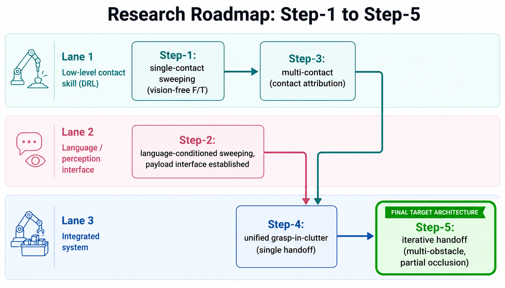

**이 그림이 이 문서의 전부다.** 오른쪽 끝의 **Step-5가 최종 목표 아키텍처**이고, 왼쪽의 네 단계는 그것을 만들기 위해 순서대로 확보해야 하는 구성요소다. 두 갈래(① 접촉 스킬 라인, ② 인지 인터페이스 라인)가 병렬로 진행되어 ③에서 합류한다 — 이 병렬성이 인력 배치의 근거가 된다(§5).

### 단계 명명

| Step | 이름 | 한 줄 정의 | 새로 확보하는 능력 |
|---|---|---|---|
| **Step-1** | Vision-free F/T Sweeping | 접촉 구간에서 카메라 없이 F/T + 고유수용감각만으로 물체를 미는 정책 | 접촉 제어의 기반 |
| **Step-2** | Language-Conditioned Sweeping | 자연어 지시 → 저차원 payload → goal-conditioned 정책 | 언어 인터페이스, payload 규격 |
| **Step-3** | Multi-Contact Manipulation | 둘 이상의 물체와 동시/순차 접촉하며 조작 | contact attribution |
| **Step-4** | Grasp-in-Clutter (단일 장애물) | DRL=push 전담, VLA=접근+grasp 전담, Gate 1이 둘 사이 상시 감시 스위치 | VLA-DRL 분업 메커니즘의 최소 검증 |
| **Step-5** | **Iterative Handoff (최종)** | Step-4와 같은 메커니즘을 다중 장애물·부분관측·grasp 후 추출까지 확장 | 반복 handoff, 장면 변화 추적 |

> 참고: 본 문서의 일부 도식에는 초기 검토 단계의 표기(S1, S2, r1, r2)가 남아 있다. 대응은 **S1→Step-1, S2→Step-2, r2→Step-4, r3/r4→Step-5**이며, r1은 §2.6의 폴백 설계에 해당한다.

---

## 1. 최종 아키텍처 (Step-5)

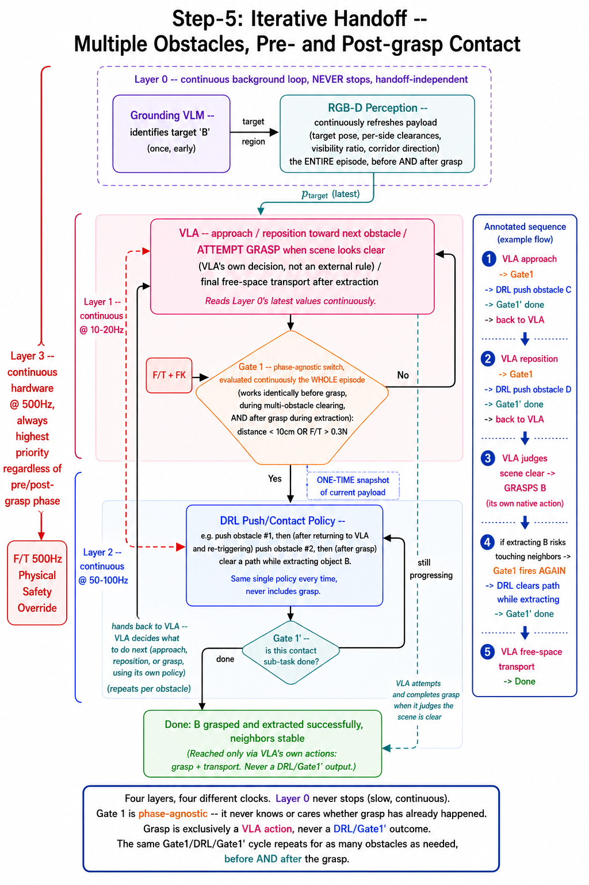

### 1.0 역할 분담 — 무엇이 바뀌었는가

| | 이전 (r2/Step-4 원안) | **개정** |
|---|---|---|
| Grasp을 누가 하는가 | DRL 정책 (force closure를 종료 조건으로) | **VLA의 네이티브 액션** — VLA가 스스로 판단해 실행 |
| DRL의 역할 범위 | "push+grasp 통합" | **접촉 위험 구간의 정밀 제어 전반** — grasp 전 밀기뿐 아니라 **grasp 후 물체를 빼낼 때 이웃과의 접촉도 포함** |
| Gate 1의 성격 | "VLA→DRL 1회 진입" 위주 | **양방향·전(全) 에피소드 상시 감시 스위치** — grasp 전이든 후든 근접/접촉이 감지되면 그때마다 DRL로 넘긴다 |
| 재관측(Grounding VLM+RGB-D Perception) | 이벤트 트리거, handoff 시에만 1회 실행 | **handoff와 무관하게 항상 배경에서 연속 실행**(다만 느린 주기) — 상세 근거는 §1.3 |

### 1.1 그림 읽기

시스템은 **네 개의 계층이 서로 다른 속도로 동시에 도는 구조**다(정확한 주기는 §1.3). Gate 1은 "언제 한 번 DRL로 넘길지"가 아니라 **"지금 이 순간 누가 로봇을 몰아야 하는가"를 에피소드 내내 계속 재판정하는 스위치**임을 유념하고 읽는다.

1. **계층 0 (배경, 항상 연속 실행 — 느리지만 트리거 아님)** — Grounding VLM이 자연어 지시에서 목표 물체를 식별하고(대체로 에피소드 시작 시 한 번이면 충분), RGB-D Perception이 장면에서 저차원 payload(pose·clearance·가시율)를 **handoff 여부와 무관하게 계속** 갱신해 발행한다.
2. **VLA (분홍, 연속 10~20Hz)** — 계층 0의 최신 발행값과 자신의 카메라를 함께 보며, 접근·재배치·**grasp 시도**를 스스로 판단해 실행한다. 텍스트를 생성할 필요는 없다. **grasp을 시도할지 말지는 VLA 자신의 판단이며, 별도의 규칙으로 지시하지 않는다.**
3. **Gate 1 (연주황 마름모, 상시 감시, VLA 루프에 동기)** — "손이 충분히 가까워졌는가(`distance < 10cm`) 또는 이미 무언가에 닿았는가(`F/T > 0.3N`)"만 판정한다. 이 판정은 **grasp 여부·에피소드 진행 단계와 무관하다** — grasp 전 접근 중이든, grasp 후 물체를 빼내는 중이든 동일하게 적용된다. F/T는 센서에서 직접 읽고 거리는 순기구학으로 계산하며, VLA/VLM 어느 쪽도 거치지 않는다(§2.2).
4. **DRL sub-maneuver (파랑, 연속 50~100Hz)** — vision 없이 F/T 피드백만으로 접촉이 필요한 서브태스크를 수행한다. 예: grasp 전이라면 "전면 물체와 접촉 유지 + 측면 물체를 밀며 삽입", grasp 후라면 "쥔 물체를 이웃과 부딪히지 않게 빼내기". **매번 같은 하나의 push/contact 정책**이 실행된다(grasp 자체는 이 정책의 산출물이 아니다).
5. **Gate 1′ (청록 마름모, 복귀 판정, DRL 루프에 동기)** — 이 서브태스크가 끝났는가(성공 또는 더 진행 불가)만 판단해 VLA에게 되돌려준다. **"grasp 성공"은 여기서 나오는 결과가 아니다** — grasp은 복귀 후 VLA가 실행한다.
6. **F/T 500Hz 안전장치 (빨강 점선, 연속·하드웨어)** — 위험 수준의 힘이 감지되면 위의 모든 판단을 무시하고 즉시 정지한다. 에피소드의 어느 단계든 항상 최우선.

**루프는 한 번으로 끝나지 않는다.** 장애물이 여러 개면 2~5번이 장애물 수만큼 반복되고, grasp 이후 물체를 빼낼 때 다시 근접/접촉이 감지되면 **똑같은 메커니즘으로 한 번 더** DRL이 개입한다 — grasp 전용 특수 처리가 없다는 것이 이 설계의 핵심 단순성이다.

### 1.2 이 구조가 필요한 이유 — 대상 시나리오

```
목표 물체 B의 좌·우(A, C)뿐 아니라 전면(D)에도 물체가 있고, D 때문에 B가 부분적으로만 보인다.

필요한 동작:
  ① 전면 물체 D를 접촉(살짝 밀기)한 상태에서 손을 더 안쪽으로 삽입          → Gate1: DRL(D를 밀며 삽입)
  ② D와의 접촉을 유지한 채, 우측 물체 C를 오른쪽으로 밀며 삽입 계속           → 같은 DRL 서브태스크 연장
  ③ 확보된 공간으로 목표 B를 grasp                                          → Gate1′ 복귀 → VLA가 grasp 실행
  ④ B를 들고 빼내는 중 A·C에 다시 닿을 것 같으면                            → Gate1 재판정 → DRL(빼내기 서브태스크)
  ⑤ 완전히 빠져나오면                                                       → Gate1′ 복귀 → VLA가 자유공간 이동으로 종료
```

①~③만 필요했던 이전 버전과 달리, **④·⑤(grasp 이후 구간)까지 같은 Gate 1/DRL/Gate 1′ 메커니즘으로 커버된다.** 이 시퀀스를 한 번의 handoff로 끝내기 어려운 이유는 여전히 세 가지다. (i) 물체들이 이동하므로 payload가 계속 갱신되어야 한다(그러나 이는 계층 0이 애초에 연속으로 돌기 때문에 자동으로 해결된다, §1.3). (ii) 부분관측이 진행 중에 해소된다. (iii) 다단계 접촉 시퀀스를 한 번의 정보만으로 수행하는 것은 학습 난도가 급상승한다.

### 1.3 루프 주기 계층 구조 — 계층 0은 "느리지만 항상 켜져 있다"

Grounding VLM · VLA · RGB-D Perception이 그림에서 한 영역에 있어 마치 세 모델을 이어붙인 융합 블록처럼 보일 수 있다. **실제로는 표준적인 다중 주기 비동기 제어 스택(각 계층이 자기 속도로 항상 돌면서, 아래 계층은 위 계층이 마지막으로 발행한 값을 그냥 읽어 쓰는 구조)이다.**

| 계층 | 구성요소 | 실행 방식 | 주기 |
|---|---|---|---|
| **0 — 배경, 항상 연속** | Grounding VLM → RGB-D Perception | **연속 루프, 그러나 느림** — handoff 여부와 무관하게 항상 실행되며 최신값을 계속 발행 | ~1~5Hz (VLM 추론 속도 한계) |
| **1 — 연속·중속** | VLA + Gate 1 판정 | 계층 0의 최신 발행값을 그대로 읽어 씀 | **10~20Hz** |
| **2 — 연속·고속** | DRL 접촉 정책 + Gate 1′ | 계층 0을 **의도적으로 읽지 않음** — 진입 순간의 값만 스냅샷으로 취득 후 vision-free 유지 | **50~100Hz** |
| **3 — 연속·최고속·하드웨어** | F/T 안전장치 | 항상 최우선 | **500Hz** |

**핵심 정정**: 계층 0은 "이벤트가 있을 때만" 켜지는 것이 아니라 **처음부터 끝까지 계속 돌고 있다.** VLM 추론이 무거워 10Hz급으로는 못 돌 뿐(느림 ≠ 트리거식), 그 자체는 항상 실행 중이며 최신 추정치를 끊임없이 갱신해 발행한다. 계층 1(VLA)은 그 최신값을 매 스텝 자연스럽게 읽어 쓴다. 계층 2(DRL)가 "1회만 받는 것처럼" 보였던 이유는 계층 0이 멈췄기 때문이 아니라, **DRL이 vision-free 설계 원칙에 따라 handoff 순간의 값만 의도적으로 스냅샷 취득하고 이후에는 계층 0을 더 이상 읽지 않기 때문**이다. 계층 0은 그 사이에도 계속 갱신을 이어간다 — 다음 handoff 때 다시 최신값을 제공하기 위해서다.

이 정정 덕분에 **재관측을 위한 별도의 "트리거 요청" 메커니즘이 필요 없다.** Gate 1′이 "복귀"를 결정하면, VLA는 그냥 계층 0이 이미 계속 갱신해 온 최신 상태를 즉시 넘겨받는다.

---

## 2. 최종 아키텍처의 구성요소

### 2.1 제어 이양의 네 가지 축

"VLA와 DRL 사이의 제어 이양(handoff)"은 하나의 결정이 아니라 **네 개의 독립적인 질문**으로 분해된다. 이 분해가 설계와 인력 배치 모두의 기준이 된다.

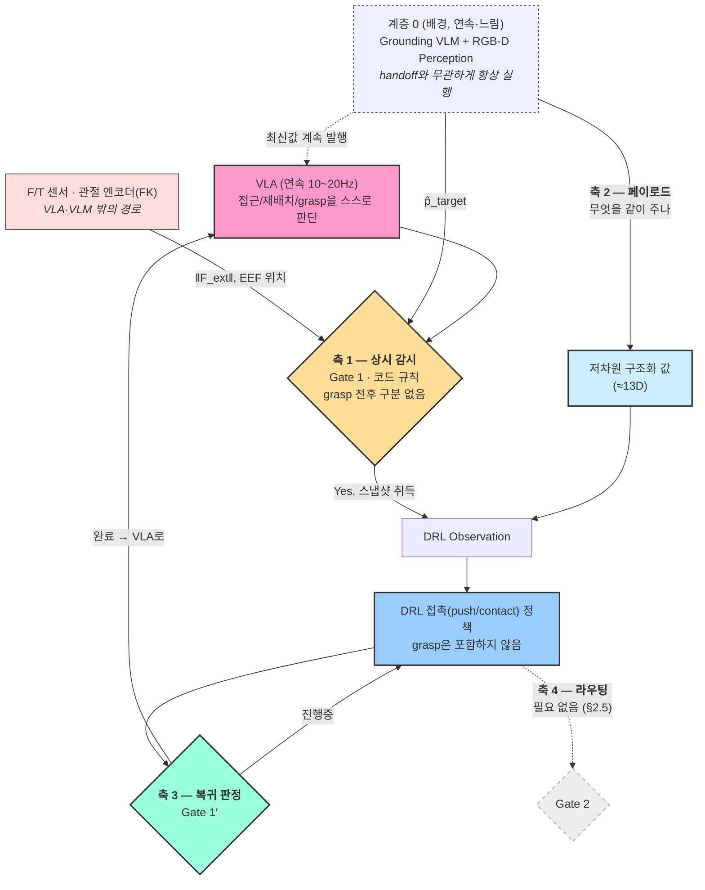

> **축 1의 입력에 주의**: Gate 1은 VLA의 출력이 아니다. 접촉력은 센서에서 직접, EEF 위치는 순기구학에서 오고, 계층 0(VLM/perception)이 기여하는 것은 `p̂_target` 하나뿐이다(§2.2). **또한 Gate 1은 "지금이 grasp 전인지 후인지"를 모른다** — 근접·접촉 여부만 보는 순수 저수준 스위치이며, 에피소드 내내 반복 평가된다.

| 축 | 질문 | 최종 설계에서의 구현 |
|---|---|---|
| **축 1 — 상시 감시(양방향 스위치)** | 지금 이 순간 VLA·DRL 중 누가 몰아야 하나 | 코드 규칙, 에피소드 내내 반복 평가 (§2.2) |
| **축 2 — 페이로드** | 넘길 때 무엇을 같이 주나 | 저차원 구조화 값 ≈13D, 계층 0이 연속 발행 (§2.3) |
| **축 3 — 복귀 판정** | 언제 DRL→VLA로 되돌리나 | 규칙 2종 — grasp 여부는 모름 (§2.4) |
| **축 4 — 라우팅** | DRL 내부에서 여러 스킬 중 무엇을 고르나 | **사용하지 않음** — grasp이 애초에 DRL의 스킬 목록에 없으므로 (§2.5) |

### 2.2 축 1 — Gate 1은 학습 대상이 아니며, grasp 전후를 구분하지 않는다

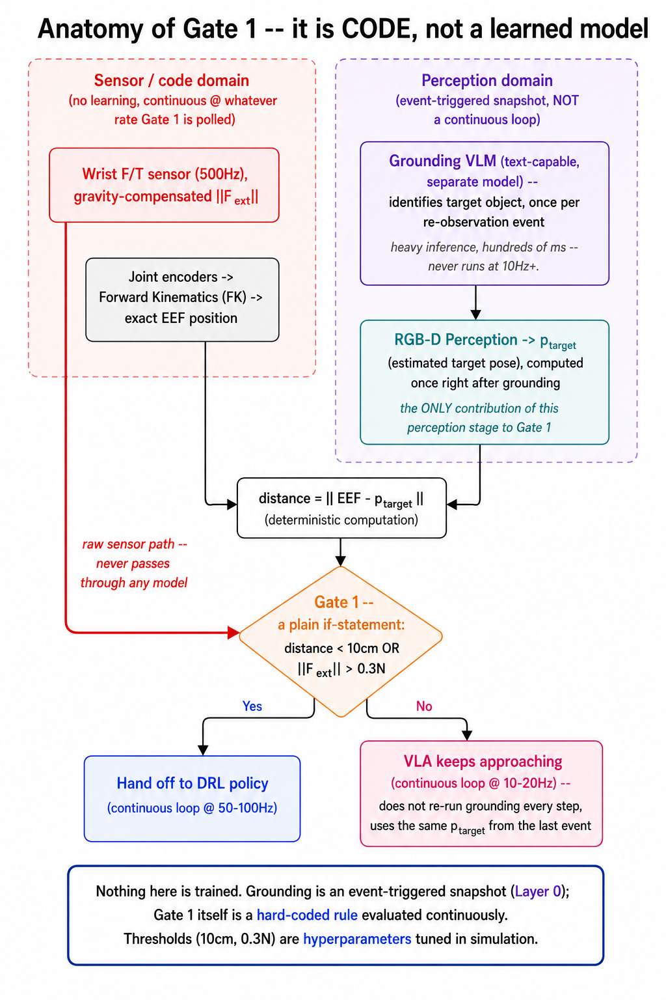

Gate 1은 신경망이 아니라 **컨트롤러 코드의 if문**이며, **VLA가 몰고 있든 방금 grasp을 마쳤든 상관없이 에피소드 내내 계속 평가된다.** 두 조건이 각각 다른 경로로 들어온다.

- **`F/T > 0.3N`** — 손목 F/T 센서(500Hz, 중력보상 후)에서 **직접** 읽는다. 오픈소스 VLA의 입력은 이미지+언어(일부는 proprioception)뿐이므로, 접촉력은 애초에 VLA를 거칠 수 없는 정보다.
- **`distance < 10cm`** — `distance = ‖FK(q) − p̂_target‖`로 계산한다. `FK(q)`는 관절 엔코더에서 정확히 얻어지고, `p̂_target`(목표 pose 추정)만 계층 0에서 온다. 즉 계층 0의 기여는 `p̂_target` 하나이며, 비교 자체는 산술 연산이다.

임계치 `10cm`, `0.3N`은 학습 파라미터가 아니라 시뮬레이션에서 튜닝하는 **하이퍼파라미터**다. **Gate 1은 "지금 grasp을 시도해야 하는가"를 판단하지 않는다** — 그건 VLA 자신의 몫이다(§1.1). Gate 1은 오직 "지금 정밀 접촉 제어가 필요한 근접/접촉 상태인가"만 본다. 그래서 grasp 전 접근이든, grasp 후 물체를 빼내는 중이든 완전히 동일한 규칙이 적용된다.

### 2.3 축 2 — 페이로드는 저차원 구조화 값, 계층 0이 연속 발행

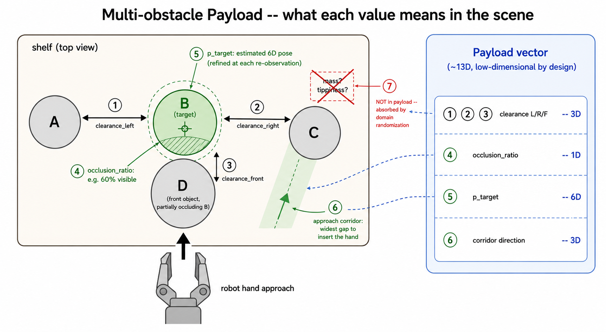

VLA의 내부 표현(latent vector)을 그대로 흘려보내지 않고, **물리적으로 해석 가능한 저차원 값**으로 변환해 전달한다. 그림의 번호가 각 항목이 장면에서 무엇을 가리키는지 보여준다.

| # | 항목 | 차원 | 의미 |
|---|---|---|---|
| ①②③ | `clearance_L/R/F` | 3D | 좌·우·전면 물체와 목표 사이의 실제 간격(m). 그리퍼 폭보다 좁으면 밀어내며 진입/추출해야 한다는 뜻 |
| ④ | `occlusion_ratio` | 1D | 목표의 가시율. 낮을수록 ⑤의 신뢰도도 낮으므로 두 값은 쌍으로 읽는다 |
| ⑤ | `p̂_target` | 6D | 목표의 추정 pose. 부분관측 시 불확실(점선 타원)하며 계층 0이 계속 갱신할수록 정밀해진다 |
| ⑥ | `corridor_direction` | 3D | 손을 삽입/추출할 통로의 방향. 후보 틈 중 최대 폭을 고르는 결정론적 규칙 |
| ⑦ | (이웃 물체 질량·전도 취약성) | — | **페이로드에 넣지 않는다.** 추정 신뢰도가 낮아 학습 시 도메인 랜덤화로 흡수 |

합계 **약 13차원**. 저차원을 유지하는 이유는 (i) 정책의 sample efficiency, (ii) 실패 시 축 단위 디버깅 가능성, (iii) VLA 모델을 교체해도 하위 계층이 영향받지 않는 모델 독립성이다.

**계층 0의 연속 발행 vs DRL의 스냅샷 소비(§1.3)**: 이 표의 값들은 계층 0(RGB-D Perception)이 handoff 여부와 무관하게 **항상 계속 계산·갱신**한다. VLA는 이 최신값을 매 스텝 그대로 읽어 쓰지만, DRL은 vision-free 설계 원칙에 따라 **진입 순간의 값만 스냅샷으로 한 번 취득**하고 이후에는 읽지 않는다 — "1회성"은 계층 0의 특성이 아니라 DRL의 의도적 소비 방식이다.

### 2.4 축 3 — 복귀 판정 (Gate 1′)은 grasp 여부를 몰라도 된다

| 복귀 조건 | 구현 | 학습 |
|---|---|---|
| 서브태스크 완료 (성공 또는 더 진행 불가) | EEF가 목표 clearance 도달, 또는 EEF 변위가 N스텝 진전 없음(밀리지 않는 물체에 막힘), 또는 타임아웃 | 불필요 |
| 아직 진행 중 | 위 조건 미충족 | 불필요 |

**Gate 1′은 두 결과만 낸다: "이 접촉 서브태스크는 끝났다(VLA에게 돌려준다)" 또는 "아직 진행 중이다."** 여기에 "grasp 성공"은 없다 — grasp은 DRL의 산출물이 아니라, 복귀 후 VLA가 스스로 판단해 실행하는 것이기 때문이다(§1.1, §2.5). 마찬가지로 이 판정은 grasp 전 밀기든 grasp 후 추출이든 동일하게 적용된다. 계층 0이 연속으로 갱신되고 있으므로(§1.3), "재관측을 요청한다"는 별도 신호도 필요 없다 — 복귀하면 VLA는 그냥 이미 최신인 상태를 넘겨받는다.

### 2.5 축 4 — 라우팅을 쓰지 않는 이유: grasp은 애초에 DRL의 스킬이 아니다

r2 설계 초안에서는 "밀기와 잡기를 하나의 DRL 정책이 함께 수행"하는 것으로 그 이유를 설명했으나, **이는 개정되었다.** 현재 설계에서 DRL의 행동 목록에는 애초에 grasp이 없다 — DRL은 오직 접촉 위험 구간의 정밀 제어(밀기·추출)만 담당하고, grasp은 100% VLA의 네이티브 액션이다.

그렇다면 "밀지 vs 잡을지"를 고르는 라우팅 게이트가 왜 필요 없는가? **Gate 1(축 1) 자체가 이미 그 라우팅이기 때문이다.** Gate 1은 "지금 정밀 접촉 제어가 필요한가"만 판정하고, 아니라면 제어권은 그냥 VLA에게 있다 — VLA는 자신의 카메라로 보고 접근을 계속할지, 재배치할지, grasp을 시도할지 스스로 정한다. 이건 DRL 내부에 별도로 추가할 결정이 아니라, **VLA가 원래 갖고 있는 generalist 능력**이다. 그래서 "DRL 내부에서 push와 grasp 중 고르는" Gate 2류의 게이트는 애초에 등장할 자리가 없다 — grasp이 DRL의 메뉴에 오른 적이 없기 때문이다.

정책은 이웃 물체와의 간격(clearance)이 0(맞닿음)부터 충분히 넓은 범위까지 폭넓게 섞인 조건에서 학습되며, "얼마나 밀어야 하는가"는 payload에 조건화된 하나의 push/contact 정책이 처리한다.

### 2.6 폴백 설계 (조건부)

여기서 검증해야 할 가설은 "**하나의 push/contact 정책이 clearance 전 범위(0부터 넓음까지)를 커버한다**"는 것이다 — grasp을 DRL이 하느냐 마느냐의 문제가 아니라, DRL 자신의 push 능력이 얼마나 일반화되는가의 문제다. 실험에서 **특정 clearance 이하로 성공률이 급락**하면, 그 구간에 한해 clearance 구간별로 특화된 복수의 push 정책(또는 방향·거리별 세분화)으로 보강한다.

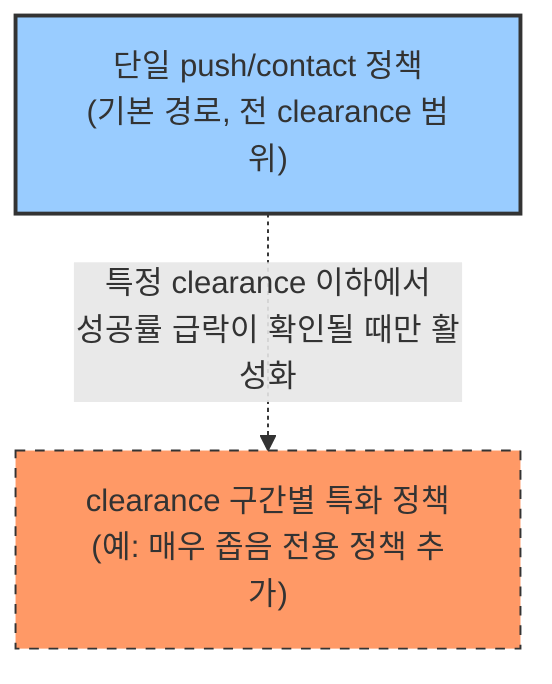

점선은 이 경로가 **처음부터 켜져 있지 않다**는 뜻이다 — 실험 결과가 나쁠 때만 추가하는 안전망이며, 켜지는 순간 축 4(라우팅)가 복귀한다.

### 2.7 학습이 필요한 것은 하나뿐

| 구성요소 | 학습 필요? | 구축 방법 |
|---|---|---|
| VLA (frozen) | ❌ | 오픈소스 모델 + 프롬프팅. 파라미터 갱신 없음 |
| Gate 1 (진입) | ❌ | 코드 if문 |
| Gate 1′ (복귀) | ❌ (규칙 2종) | 코드 규칙 — grasp 여부는 판단하지 않음 |
| 페이로드 추출 | ❌ | grounding 모델 + RGB-D 결정론적 기하 계산, handoff와 무관하게 연속 계산 |
| OSC / Admittance 실행 | ❌ | 기존 제어 자산 |
| F/T 안전장치 | ❌ | 코드 |
| **DRL 접촉 정책** | ✅ | **유일한 필수 학습** |

이것이 **GPU 2대로 이 시스템을 만들 수 있다는 주장의 근거**이며, §3의 기여도 논증에서 핵심 축이 된다.

### 2.8 [주의] "VLA / perception" 상자의 실현 — VLA의 언어 출력 능력은 당연하지 않다

본 문서의 상단 상자를 "VLA / perception"으로 표기한 이유는, **기호적 판단(목표 식별·언어 해석)을 반드시 VLA 자신의 latent에서 꺼낼 수 있다고 가정하지 않기 때문**이다. "VLA의 latent에 텍스트 head를 붙이면 VLM처럼 답한다"는 보장은 없다:

| VLA 유형 | 대표 | 텍스트 출력 가능성 |
|---|---|---|
| VLM + action-token 파인튜닝 | RT-2, OpenVLA [3] | 구조상 LM head는 남아 있으나, **로봇 데이터만으로 파인튜닝된 모델(OpenVLA)은 일반 텍스트 생성 능력이 퇴화**한다(프롬프트에 대해 action token을 출력하도록 분포가 이동). RT-2는 웹 데이터 co-fine-tuning으로 보존을 명시적으로 설계했으나 비공개 |
| VLM backbone + 별도 action expert | π0 [5], GR00T N1 [20] | backbone이 action 학습에 함께 갱신되면 언어 능력이 퇴화할 수 있다. 이를 막는 기법(knowledge insulation — action expert의 gradient를 backbone에서 차단) 계열이 별도로 제안된 사실 자체가 "그냥은 안 된다"는 방증. VLM을 별도 시스템으로 유지하는 구조(GR00T N1의 System 2)가 상대적으로 유리 |
| 비-LLM 기반 | Octo [4] | **원천 불가** — 언어는 인코더로 입력만 받고, 텍스트를 생성하는 decoder/LM head 자체가 없다 |

**따라서 실현 방식은 다음 셋 중 하나로 한정된다**:

1. **(권장) 이중 모델** — 기호 판단·grounding은 텍스트 출력이 본업인 **순수 VLM**(또는 grounding 전용 모델)이 담당하고, VLA는 일반 모션 실행에만 사용한다. forward 2회의 비용이 들지만 10~20Hz 요구 수준에서 감당 가능하며, 어떤 오픈 모델 조합으로도 성립한다.
2. 언어 능력이 보존된 VLA 선택 — System-2 보존형(GR00T N1류) 또는 co-training/insulation이 적용된 모델. **VLA 후보 선정 기준에 "텍스트 능력 보존 여부"를 명시적으로 포함해야 한다** (Step-2 담당자의 모델 선정 체크리스트 항목).
3. (비권장) LoRA로 텍스트 경로 복원 — 가능하지만 action 능력 훼손 위험과 학습 비용이 추가되어, "학습은 DRL 정책 하나뿐"이라는 §2.7의 전제를 약화시킨다.

이 주의는 §2.7의 "VLA (frozen) — 프롬프팅" 행에도 적용된다: "프롬프팅"이 성립하려면 위 1 또는 2의 실현이 전제되어야 한다. 본 로드맵의 페이로드 설계(수치는 RGB-D 기하, 기호는 grounding)는 애초에 VLA latent의 텍스트 디코딩에 의존하지 않도록 되어 있어, 이 주의가 최종 아키텍처의 성립 자체를 흔들지는 않는다.

---

## 3. 연구 기여도 — 기존 top-tier 연구 대비

### 3.1 연구 지형에서의 위치

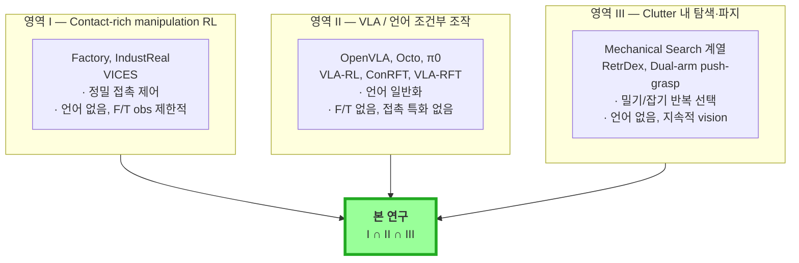

세 영역 각각에는 다수의 top-tier 연구가 있으나, **셋을 동시에 다루는 사례는 확인되지 않는다.**

### 3.2 Pros — 기여로 주장 가능한 것

| # | 기여 | 근거 및 대비 대상 |
|---|---|---|
| **P1** | **삼중 교집합의 미개척성**<br/>F/T 기반 vision-free 접촉 반응 × 자연어 지시 × clutter 내 파지 | Factory[9]·IndustReal[10]은 F/T observation과 언어가 없고, OpenVLA[3]·Octo[4]·π0[5]는 접촉력 감지와 compliant 제어가 없으며, Mechanical Search[1]·RetrDex[14]는 언어 지시와 F/T 반응이 없다 |
| **P2** | **컴퓨팅 효율성 서사**<br/>VLA를 얼리고 학습 컴포넌트를 1개로 최소화 | 2025~2026의 주류인 VLA 전체 RL 파인튜닝 계열(VLA-RL[6], ConRFT[7], VLA-RFT[8])은 대규모 GPU와 온라인 rollout을 전제한다. 본 연구는 정반대 방향의 설계이며, "제한된 컴퓨팅에서의 VLA-DRL 통합"이라는 프레이밍은 컴퓨팅 접근성 문제의식과 맞물린다 |
| **P3** | **학습된 라우팅이 필요 없는 명확한 대조축**<br/>"선행 연구는 이산 스킬(밀기/흡착/잡기)을 학습·계획된 선택으로 반복 전환하지만, 우리는 물리 상태 하나만 보는 단순 스위치(Gate 1)로 충분함을 보인다" | Mechanical Search[1] 계열은 push/suction/grasp 중 무엇을 쓸지 **학습·계획으로 반복 선택**한다. 본 연구는 grasp을 VLA의 네이티브 행동으로, push를 DRL 전담으로 분리하되, 그 사이 전환 자체는 학습이 필요 없는 근접/접촉 규칙(Gate 1)만으로 충분함을 보인다는 점에서 정반대 입장을 취한다 |
| **P4** | **검증 가능한 단일 가설 + 깔끔한 실증 포맷**<br/>"DRL push 정책 하나가 clearance 전 범위를 커버하는가" | clearance를 가로축, 성공률·이웃 변위를 세로축으로 하는 **단일 스윕 곡선**으로 "완만한 저하 vs 급락"을 보일 수 있다. 로보틱스 학습 논문에서 설득력이 검증된 결과 형태 |
| **P5** | **접촉 구간 vision 제거라는 역발상** | Lee et al.[12]은 vision+촉각 융합의 유효성을 주장하는 반면, 본 연구는 접촉 중 self-occlusion과 지연을 **구조적으로 회피**하기 위해 vision을 의도적으로 배제한다. F/T가 접촉의 선행 지표라는 근거는 충돌 감지 문헌[13]에 있다 |
| **P6** | **모델 독립적 인터페이스** | 페이로드(13D)로 추상화되어 있어 VLA 모델을 교체해도 하위 계층이 영향받지 않는다. VLA 생태계의 빠른 변화 속에서 설계 수명이 길다 |

### 3.3 Cons — 정직하게 인정해야 할 약점

| # | 약점 | 성격 및 대응 |
|---|---|---|
| **C1** | **알고리즘적 신규성 부족** — 구성요소 대부분이 기존 기법의 조합이며, 기여의 성격이 시스템 통합에 가깝다 | NeurIPS/ICML/ICLR 메인트랙은 현실적으로 어렵다. **대응**: 로보틱스 venue를 주 타깃으로 하고, 이론적 정식화(C2)로 보강 |
| **C2** | **게이트의 ad hoc 성격** — 임계치 기반 규칙은 "왜 하필 그렇게 설계했는가"라는 심사 지적을 받기 쉽다 | **대응**: 진입·복귀 조건을 option / semi-MDP의 개시·종료 조건으로 형식화[16,17]. 이 작업이 포스닥 주제에 포함된 이유 |
| **C3** | **핵심 가설의 실패 리스크** — "DRL push 정책 하나가 전 clearance 범위를 커버"가 무너지면 Step-4/5 실증 서사가 흔들린다 | **대응**: 폴백 설계(§2.6, clearance 구간별 특화 정책)를 사전 설계·문서화해 두어, 실패 시 ablation 결과로 전환 |
| **C4** | **contact attribution 미해결 리스크** — 손목 F/T는 합력만 측정하므로 동시 다중접촉에서 접촉 대상이 모호하다. grasp 전 삽입과 grasp 후 추출 양쪽에서 발생한다 | Step-3의 핵심 난제. **대응**: 순차 다중접촉까지로 범위 축소, 최후 수단으로 촉각 센서 추가 |
| **C5** | **vision-free 순수성 논쟁** — DRL이 접촉 서브태스크를 수행하는 동안은 F/T 신호만 쓰며, 진입 시점에 스냅샷으로 받은 payload에 의존한다 | **대응**: 그 스냅샷을 제거했을 때의 성능 저하를 ablation으로 정량 제시 |
| **C6** | **"도메인 랜덤화 범위를 넓힌 것 아닌가"라는 반박 가능성** | **대응**: 왜 이 센싱 조합으로 충분한지에 대한 메커니즘적 설명(F/T의 선행 지표 특성[13], VLM의 metric 추정 약점[2])을 이론 근거로 제시 |
| **C7** | **실험 규모의 열세** — GPU 2대, 실기 로봇 1대. 대형 랩의 실기 다양성·시행 횟수를 따라갈 수 없다 | **대응**: 넓은 태스크 다양성 대신 **하나의 축(clearance)을 깊게 스윕**하는 전략으로 차별화. 이것이 P4와 연결됨 |
| **C8** | **시뮬–실기 제어기 비대칭** — 시뮬은 OSC, 실기는 Admittance+DiffIK로 저수준 제어기가 다르다 | 대상 로봇이 사용자 레벨 토크 인터페이스를 제공하지 않는 데서 오는 구조적 제약. **대응**: M·D·K 파라미터 식별로 응답 특성 정합 |

### 3.4 Venue별 종합 판정

| Venue 군 | 판정 | 조건 |
|---|---|---|
| NeurIPS / ICML / ICLR | **낮음** | 알고리즘적 신규성이 요구 수준에 미달 (C1) |
| **CoRL / RSS** | **가능** | ① 실기 검증, ② VLA-RL 계열 대비 compute-efficiency 정량 비교, ③ option/semi-MDP 정식화, ④ clearance 스윕 ablation — 이 넷을 갖출 것 |
| **ICRA / IROS** | **높음** | 시스템 완성도와 실기 재현성이 평가 축이므로 현재 설계로도 경쟁력 있음 |
| RA-L / IJRR | **가능** | 단계별 결과를 RA-L로 분산 게재하고, 최종 통합 시스템을 IJRR로 확장 |

**요약**: landmark급 돌파는 아니지만, §3.4의 조건을 갖추면 **로보틱스 top-tier(CoRL/RSS)에서 정당한 기여로 방어 가능**하다. 가장 강력한 지렛대는 P2(컴퓨팅 효율성)와 P4(단일 가설의 깔끔한 실증)이며, 가장 큰 취약점은 C1(알고리즘 신규성)이므로 C2의 이론 정식화로 이를 상쇄하는 전략이 필요하다.

---

## 4. 단계별 로드맵

최종 아키텍처(Step-5)를 만들기 위해 아래 순서로 능력을 축적한다.

### Step-1 — Vision-free F/T 단일접촉 Sweeping

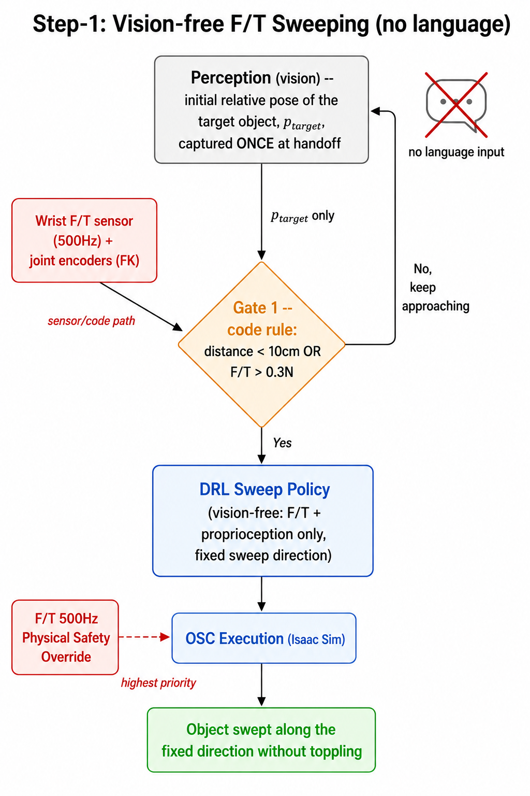

| | |
|---|---|
| **목표** | 접촉 구간에서 카메라를 쓰지 않고 F/T + 고유수용감각만으로 물체를 넘어뜨리지 않고 미는 정책 확보 |
| **새로 확보** | 접촉 제어의 기반. 인지 모듈은 handoff 시점의 목표 pose를 **1회만** 제공하고 이후 관여하지 않는다 |
| **핵심 검증** | ablation 4종 — ① F/T observation 유무, ② 물체 기준 상대좌표 vs 절대좌표, ③ Cartesian vs joint action space, ④ Admittance 유무에 따른 접촉력 프로파일 |
| **Sim-to-real** | 시뮬 OSC ↔ 실기 Admittance의 M·D·K 파라미터 식별로 step force 응답 정합 |
| **성공 기준** | 시뮬 성공률 ≥ 90%, 이웃 물체 전도율 ≤ 5%, F/T obs의 성능 기여 정량 입증 |

### Step-2 — 언어 조건부 Sweeping (페이로드 인터페이스 확립)

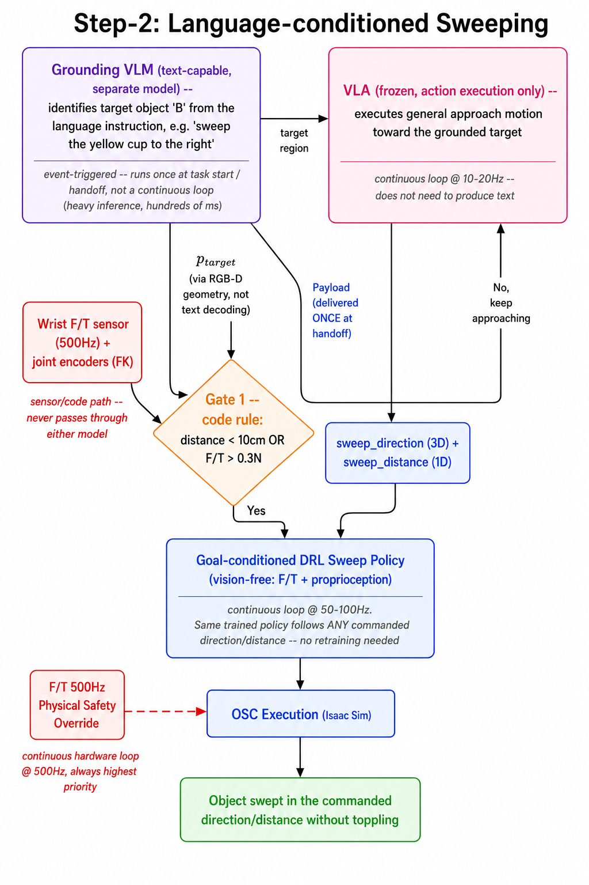

| | |
|---|---|
| **목표** | 자연어 지시로 밀기 방향·거리를 지정하고, 같은 정책이 재학습 없이 임의의 목표를 따르게 함 |
| **새로 확보** | **페이로드 인터페이스** — 이 단계에서 확립한 규격이 Step-4/5까지 그대로 계승된다 |
| **핵심 검증** | 페이로드 추출 방식 3종 비교 — ⓐ VLA에 수치를 직접 질의(텍스트 디코딩), ⓑ frozen backbone + 회귀 head, ⓒ RGB-D 기반 결정론적 기하 계산. 시뮬 GT 대비 위치·거리 오차로 평가 |
| **기대 결과** | **의미 판단은 ⓐ, 미터 단위 수치는 ⓒ**가 유리할 것으로 예상 — VLM의 metric 추정 약점[2]에 근거하며, 이 예상을 정량적으로 검증하는 것 자체가 기여 |
| **성공 기준** | 목표 위치 오차 ≤ 2cm, clearance 오차 ≤ 1cm, 페이로드 v1 규격 동결 |

### Step-3 — 다중접촉 조작 (contact attribution)

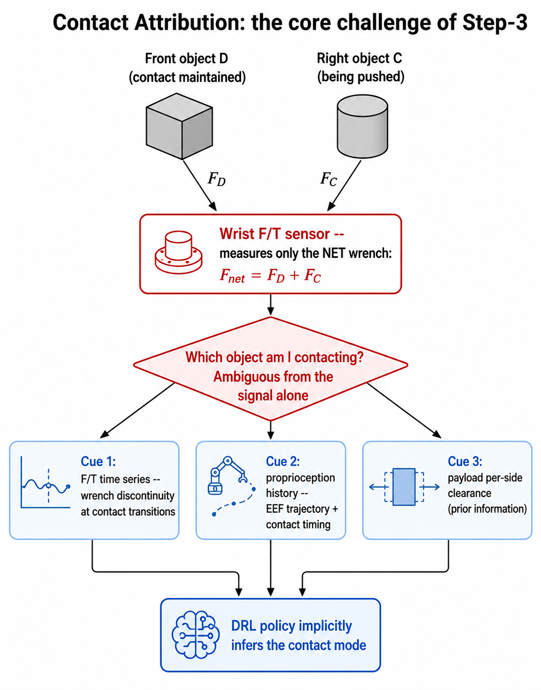

| | |
|---|---|
| **목표** | 둘 이상의 물체와 순차·동시에 접촉하며 조작하는 능력 |
| **핵심 난제** | **contact attribution** — 손목 F/T는 합력만 측정하므로, 전면 물체와 접촉을 유지한 채 우측 물체를 밀면 두 힘이 합쳐져 들어와 접촉 대상이 신호만으로 구분되지 않는다. Grasp 전 삽입뿐 아니라 **grasp 후 물체를 빼낼 때 이웃과 동시 접촉하는 경우**에도 동일하게 발생하며, Step-5 시나리오의 ②·④번 동작이 성립하려면 반드시 풀어야 한다 |
| **접근** | 위 그림의 단서 3종을 정책 입력으로 제공하고 암묵적 추정을 학습. 실패 시 순차 다중접촉으로 범위 축소, 최후에 촉각 센서 추가 |
| **단계** | 순차(A 밀고 → C 밀기) → 동시(전면 유지 + 측면 밀기) |
| **학술적 위치** | 이 문제 자체가 독립적인 기여로 성립 — 저비용 wrist F/T만으로 다중접촉을 다루는 시도는 촉각 센서 기반 연구들과 뚜렷이 구분된다 |

### Step-4 — Grasp-in-Clutter: VLA-grasp + DRL-push 분업 (단일 장애물)

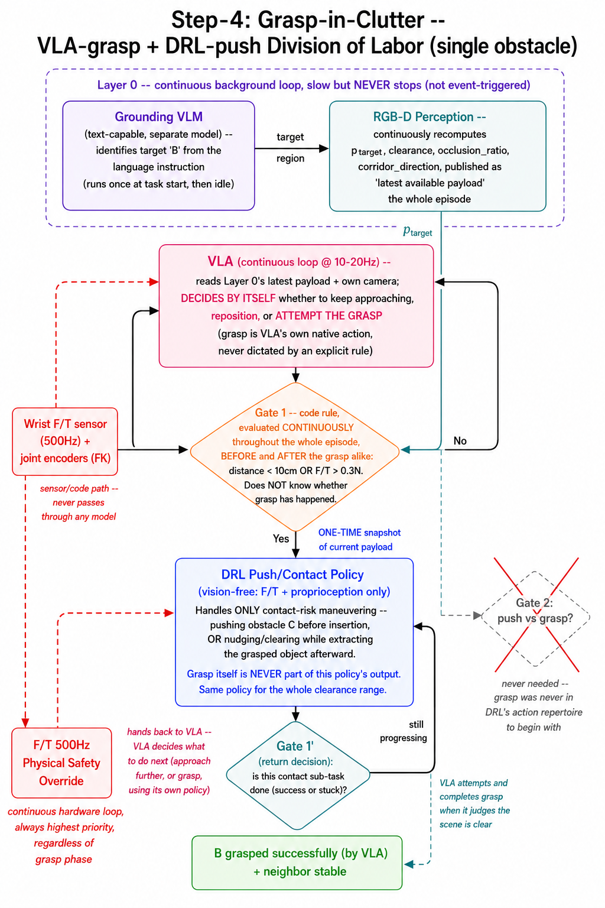

> **개정**: "밀기와 잡기를 하나의 DRL 정책이 함께 수행"하던 원안에서, **grasp은 VLA의 네이티브 액션, DRL은 push/contact 전담**으로 역할을 나눴다(§2.5). Gate 1은 여러 스킬을 고르는 라우팅이 아니라 "지금 정밀 접촉 제어가 필요한가"만 보는 상시 감시 스위치이며, 이 스위치 자체가 VLA↔DRL 분업을 실현한다 — 별도의 라우팅 게이트가 추가로 필요 없는 이유이기도 하다.

| | |
|---|---|
| **목표** | 장애물이 하나뿐인 단순 시나리오에서 VLA(접근+grasp)와 DRL(push) 분업 메커니즘 자체를 검증 |
| **새로 확보** | Gate 1(상시 감시 스위치) + Gate 1′(복귀 판정) + 저차원 payload 인터페이스의 최소 동작 확인 |
| **학습 설계** | DRL push/contact 정책만 학습 — ① clearance를 0(맞닿음)~넓음까지 전 범위 도메인 랜덤화, ② 커리큘럼(넓게 시작 → 점점 좁힘), ③ 보상 = 목표 clearance 확보 + 이웃 안정 + 접촉력 상한, ④ 종료 = clearance 확보(Gate 1′ 복귀) — **force closure/grasp 성공이 아니다**, grasp은 복귀 후 VLA가 별도로 수행 |
| **핵심 실험** | **clearance-성공률 스윕 곡선** — DRL push 정책 하나가 clearance 전 범위를 완만하게 커버하는가, 급락하는가 (§3.2 P4) |
| **분기 판정** | 급락 구간 발견 시 폴백 설계(§2.6, clearance 구간별 특화 정책) 활성화 결정 |

### Step-5 — Iterative Handoff (최종): 다중 장애물 + grasp 후 추출까지


> Step-4와 **메커니즘은 동일**하다(Gate 1/DRL push/Gate 1′/VLA grasp). 차이는 시나리오 복잡도뿐이다 — 장애물이 여러 개라 Gate1↔DRL↔Gate1′ 사이클이 여러 번 반복되고, grasp 이후 물체를 빼내는 과정에서도 같은 사이클이 다시 발동할 수 있다(§1.2 ④·⑤).

| | |
|---|---|
| **목표** | 전면+측면 다중장애물과 부분관측 환경에서, grasp 전 클리어링부터 grasp 후 추출까지 전체 시퀀스로 파지 완수 |
| **새로 확보** | ① 다중 장애물에 걸친 Gate1/Gate1′ 반복 사이클, ② 페이로드의 다중장애물 확장(방향별 clearance·가시율·삽입 통로), ③ Step-3의 contact attribution을 grasp 후 추출 국면까지 확장 적용 |
| **학습 추가 요소** | 시뮬 학습 중 에피소드 내에 **장애물을 2개 이상 배치**해 DRL push 정책이 여러 차례 handoff받는 경험을 포함, grasp 후 추출 국면의 접촉도 학습 시나리오에 포함 |
| **최종 검증** | §1.2 시나리오(①~⑤ 전체) 성공률 + VLA-RL 계열 대비 compute-efficiency 비교 + option/semi-MDP 정식화(Gate 1의 상시 감시 스위치를 개시·종료 조건이 있는 option으로 형식화) |

---

## 5. 실행 계획

### 5.1 인력 배치

전체 조감도의 두 갈래(① 접촉 스킬, ② 인지 인터페이스)가 병렬이므로, 저수준 연구와 상위 통합을 동시에 진행한다.

| 인력 | 기간 | 담당 Step | 주제 |
|---|---|---|---|
| **석사 A** | ~2027.02 | Step-1 | 단일접촉 vision-free F/T sweeping + sim-to-real |
| **석사 B** | ~2027.02 | Step-2 | 페이로드 추출 파이프라인 + 추출 방식 3종 비교 |
| **학부생 F** | 2026.09~ | 공통 인프라 | clearance 파라미터화 씬 생성기 + 평가 하네스 |
| **연구원 C**<br/>(석사 졸업 후 1년) | 2027.03~2028.02 | Step-3 | 다중접촉 — contact attribution |
| **박사 D** | ~2028.02 | Step-4 | 통합 grasp-in-clutter 시스템 (학위논문) |
| **포스닥 E** | 전 기간 | Step-5 | Iterative handoff, 이론 정식화, compute 비교, 최종 통합 |

**학부생 주제의 중요성**: clearance를 파라미터로 하는 절차적 씬 생성기와 자동 평가 하네스는 Step-4의 핵심 실험(스윕 곡선, §3.2 P4)을 가능하게 하는 인프라다. 이것이 없으면 단계 전환 판정 자체가 불가능하다.

### 5.2 타임라인

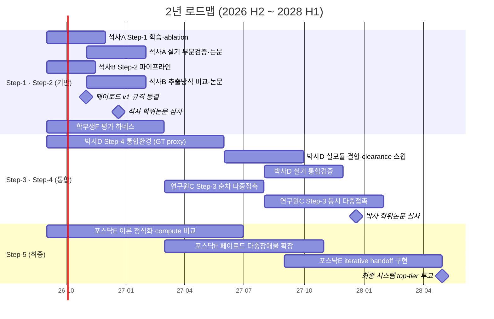

### 5.3 병렬화의 근거 — 서로 기다리지 않는 구조

**학습·배포 2단계 분리**: 학습 시에는 시뮬레이터 ground truth로 페이로드를 계산하고, 배포 시에만 실제 인지 모듈 값을 쓴다. 여기에 노이즈 도메인 랜덤화를 더해 인지 오차에 강건하게 만든다.

> 결과적으로 **박사 D는 석사 B의 페이로드 모듈 완성을 기다릴 필요가 없다.** GT proxy로 먼저 통합 환경을 만들고, 이후 실모듈로 교체한다. 연구원 C의 다중접촉 정책도 같은 방식으로 선행 착수 가능하다.

**전제 조건은 인터페이스 동결**이다. 2026년 10월까지 아래를 문서로 고정한다.

```
[페이로드 규격 v1]  (≈13D)
  p̂_target            6D   목표 물체 추정 pose
  clearance_L/R/F     3D   방향별 여유공간 (m)
  occlusion_ratio     1D   [0,1] 가시율
  corridor_direction  3D   삽입 통로 방향 (unit vector)
  + 좌표계·단위·갱신 주기·결측 시 기본값 명시

[Gate 1 시그니처 v1]
  입력: ‖F_ext‖ (F/T, 중력보상 후), FK(q), p̂_target
  출력: bool
  임계치: distance_th = 0.10 m, force_th = 0.3 N   (튜닝 대상)
```

### 5.4 단계 전환 조건

| 전환 | 시점 | 조건 |
|---|---|---|
| **Step-1·2 → Step-3·4** | 2027.02 | 정책 성공률 ≥ 90% / 전도율 ≤ 5% / F/T obs 기여 입증 / 페이로드 오차 위치 ≤ 2cm, clearance ≤ 1cm / 평가 하네스 자동 실행 / 규격 v1 동결 |
| **Step-3·4 → Step-5** | 2027.12 | clearance 스윕에서 급락 없는 저하 곡선 확인(급락 시 폴백 결정) / 동시 다중접촉 동작 / 실기 통합 1차 검증 |
| **Step-5 완료** | 2028.08 | §1.2 시나리오 성공 / compute-efficiency 비교 완료 / top-tier 투고 |

---

## 6. 논문 산출 계획

| # | 주제 | 1저자 | 목표 venue | 시점 |
|---|---|---|---|---|
| P1 | Step-1 — vision-free F/T sweeping + sim-to-real | 석사 A | RA-L 또는 IROS | 2027 상반기 |
| P2 | Step-2 — 페이로드 추출 방식 비교 벤치마크 | 석사 B | IROS 또는 ICRA | 2027 상반기 |
| P3 | 평가 벤치마크·씬 생성기 공개 | 학부생 F | 국내학회 + 공개 | 2027 상반기 |
| P4 | Step-3 — wrist F/T만으로의 contact attribution | 연구원 C | ICRA 또는 RA-L | 2027 하반기 |
| P5 | **Step-4 — 통합 grasp-in-clutter** | 박사 D | **CoRL 또는 RSS** | 2027 하반기 |
| P6 | **Step-5 — iterative handoff + compute-efficiency** | 포스닥 E | **RSS/CoRL → IJRR 확장** | 2028 상반기 |

> 마감은 통상 ICRA 9월, IROS 3월, RSS 1~2월, CoRL 4~5월경이나 매년 변동하므로 투고 6개월 전 확인 필요.

---

## 7. 리스크 관리

| # | 리스크 | 대응 | 관련 |
|---|---|---|---|
| R1 | 석사 2명의 논문 일정이 촉박(약 4개월) | 기존 학습 환경 자산 위에서만 작업, 실기는 부분 검증으로 제한 | Step-1,2 |
| R2 | 시뮬레이션 asset 미확보 | **최우선 해결** — 착수 1주 내 확보 | 전체 |
| R3 | contact attribution 미해결 | 순차 다중접촉으로 범위 축소, 최후에 촉각 추가 | C4, Step-3 |
| R4 | 단일 정책 가설 실패 | 폴백 설계 활성화 (§2.6) | C3, Step-4 |
| R5 | 실기 로봇 1대 병목 | 시뮬 우선, 주 단위 슬롯 사전 배분(논문 시즌 우선권) | C7 |
| R6 | 연구원 C 출국으로 인한 공백(2028.02) | 인계 문서 + 코드 리뷰를 2027.12까지 의무화 | Step-3 |
| R7 | 오픈소스 VLA 생태계 급변 | 페이로드 추상화로 영향 국소적 — 모델 교체해도 하위 계층 불변 | P6 |

### 즉시 착수 (다음 4주)

| 우선 | 항목 | 담당 |
|---|---|---|
| 🔴 | 시뮬레이션 asset 확보 | 학부생 F + 석사 A |
| 🔴 | 인터페이스 v1 초안 (페이로드 + Gate 1 시그니처) | 포스닥 E |
| 🟡 | 기존 sweeping 정책 재현 확인 + ablation 설계 | 석사 A |
| 🟡 | grounding 모델 + RGB-D 파이프라인 스모크 테스트 | 석사 B |
| 🟡 | clearance 파라미터화 씬 생성기 프로토타입 | 학부생 F |
| 🟡 | GT proxy 기반 Step-4 통합 환경 골격 | 박사 D |
| 🟢 | 실기 로봇 사용 슬롯 배분표 | 포스닥 E |

---

## 부록 A. 참고문헌

> 링크는 검증된 arXiv 항목만 직접 연결하고, 나머지는 제목·게재처로 표기했다.

**Clutter 내 탐색·파지 (영역 III)**
- [1] Danielczuk et al., "Mechanical Search: Multi-Step Retrieval of a Target Object Occluded by Clutter", ICRA 2019. https://arxiv.org/abs/1903.01588
- [14] "RetrDex: Efficient Object Retrieval in Cluttered Scenes with a Dexterous Hand", 2025. https://arxiv.org/abs/2502.18423
- [15] "Learning Dual-Arm Push and Grasp Synergy in Dense Clutter", 2024. https://arxiv.org/abs/2412.04052

**VLA / 언어 조건부 조작 (영역 II)**
- [3] Kim et al., "OpenVLA: An Open-Source Vision-Language-Action Model", CoRL 2024. https://arxiv.org/abs/2406.09246
- [4] Octo Team, "Octo: An Open-Source Generalist Robot Policy", RSS 2024. https://arxiv.org/abs/2405.12213
- [5] Black et al., "π0: A Vision-Language-Action Flow Model for General Robot Control", 2024. https://arxiv.org/abs/2410.24164
- [2] Chen et al., "SpatialVLM: Endowing Vision-Language Models with Spatial Reasoning Capabilities", CVPR 2024. https://arxiv.org/abs/2401.12168
- [20] NVIDIA, "GR00T N1: An Open Foundation Model for Generalist Humanoid Robots", 2025.

**VLA의 RL 파인튜닝 계열 (P2의 대비 대상)**
- [6] "VLA-RL: Towards Masterful and General Robotic Manipulation with Scalable Reinforcement Learning", 2025. https://arxiv.org/abs/2505.18719
- [7] Chen et al., "ConRFT: A Reinforced Fine-tuning Method for VLA Models via Consistency Policy", 2025. https://arxiv.org/abs/2502.05450
- [8] "VLA-RFT: Vision-Language-Action Reinforcement Fine-Tuning with Verified Rewards in World Simulators", 2025. https://arxiv.org/abs/2510.00406

**Contact-rich manipulation RL (영역 I)**
- [9] Narang et al., "Factory: Fast Contact for Robotic Assembly", RSS 2022.
- [10] Tang et al., "IndustReal: Transferring Contact-Rich Assembly Tasks from Simulation to Reality", RSS 2023.
- [11] Martín-Martín et al., "Variable Impedance Control in End-Effector Space: An Action Space for Reinforcement Learning in Contact-Rich Tasks", IROS 2019.

**센싱·제어 근거**
- [12] Lee et al., "Making Sense of Vision and Touch: Self-Supervised Learning of Multimodal Representations for Contact-Rich Tasks", ICRA 2019. https://arxiv.org/abs/1810.10191
- [13] Haddadin et al., "Robot Collisions: A Survey on Detection, Isolation, and Identification", IEEE T-RO 2017.

**이론 정식화 (C2 대응)**
- [16] Bacon et al., "The Option-Critic Architecture", AAAI 2017. https://arxiv.org/abs/1609.05140
- [17] Sutton, Precup, Singh, "Between MDPs and semi-MDPs: A framework for temporal abstraction in reinforcement learning", Artificial Intelligence 1999.

**Sim-to-real**
- [18] Tobin et al., "Domain Randomization for Transferring Deep Neural Networks from Simulation to the Real World", IROS 2017. https://arxiv.org/abs/1703.06907
- [19] Peng et al., "Sim-to-Real Transfer of Robotic Control with Dynamics Randomization", ICRA 2018. https://arxiv.org/abs/1710.06537

---

## 부록 B. 도식 생성 프롬프트

문서의 도식 중 §2.1(네 축)과 §2.6(폴백 분기)은 Mermaid로 렌더링되며, 나머지는 이미지 파일이다. 아래는 **전체 조감도**와 **Step-3 contact attribution** 그림을 생성할 때 사용한 프롬프트로, 수정·재생성이 필요할 때 참고한다.

<details>
<summary>프롬프트 — 전체 조감도 (Step-1~5 진행도)</summary>

```
Create a clean roadmap diagram, flat vector illustration, white background,
engineering-blueprint style, titled "Research Roadmap: Step-1 to Step-5"
at the top center.

Draw three horizontal lanes with labels on the left:
- Lane 1 (light teal), "Low-level contact skill (DRL)": two boxes connected by
  a right arrow -- "Step-1: single-contact sweeping (vision-free F/T)" then
  "Step-3: multi-contact (contact attribution)".
- Lane 2 (light pink), "Language / perception interface": one box --
  "Step-2: language-conditioned sweeping, payload interface established".
- Lane 3 (light blue), "Integrated system": two boxes connected by a right
  arrow -- "Step-4: unified grasp-in-clutter (single handoff)" then
  "Step-5: iterative handoff (multi-obstacle, partial occlusion)".

Draw converging arrows from the Step-3 box and the Step-2 box into the Step-4
box, showing that both lanes feed the integrated system.

Make the "Step-5" box visually dominant: bright green fill, thick border, and
a small banner label "FINAL TARGET ARCHITECTURE".

Use rounded rectangles, clean sans-serif labels, generous white space, clear
left-to-right progression. Suitable as the opening figure of a research plan.
```

</details>

<details>
<summary>프롬프트 — contact attribution 문제 (Step-3)</summary>

```
Create a clean technical explainer diagram, flat vector illustration, white
background, titled "Contact Attribution: the core challenge of Step-3".

Top: two gray object icons side by side, labeled "Front object D (contact
maintained)" and "Right object C (being pushed)". From each, draw an arrow
labeled "F_D" and "F_C" respectively, both converging into a single red-bordered
box labeled "Wrist F/T sensor -- measures only the NET wrench: F_net = F_D + F_C".

Below that box, a large red-tinted diamond: "Which object am I contacting?
Ambiguous from the signal alone".

From the diamond, three arrows fan out to three light-blue boxes:
- "Cue 1: F/T time series -- wrench discontinuity at contact transitions"
- "Cue 2: proprioception history -- EEF trajectory + contact timing"
- "Cue 3: payload per-side clearance (prior information)"

All three converge into a blue box at the bottom: "DRL policy implicitly infers
the contact mode".

Use rounded rectangles, red for the ambiguity problem, light blue for cues,
blue for the policy. Clean sans-serif labels, minimal clutter, teaching-figure
style.
```

</details>

---

## 부록 C. Step-5 방법 vs 현재 SOTA — 상세 비교

> §3이 프로젝트 전체의 기여도를 다뤘다면, 이 부록은 **최종 방법 자체** — frozen VLA/perception + 저차원 페이로드 + 코드 게이트 + vision-free F/T 단일 DRL 정책 + iterative handoff — 를 현재 SOTA 방법군과 **방법론 수준에서 정면 비교**한다. 각 비교는 "우리가 어디서 이기고, 어디서 지는가"를 모두 명시한다. 본 방법은 아직 제안 단계이므로, 아래의 모든 우위 주장은 실험으로 입증되어야 할 가설임을 전제한다.

### C.1 비교 대상 — 네 가지 SOTA 방법군

| 방법군 | 대표 연구 | 한 줄 특징 |
|---|---|---|
| **① End-to-end VLA** | π0 [5], OpenVLA [3], GR00T N1 [20] | 하나의 대형 모델이 인지→행동 전체를 담당. 대규모 원격조작 데모로 학습 |
| **② VLA + RL 파인튜닝** | ConRFT [7], VLA-RL [6], VLA-RFT [8] | 사전학습 VLA의 파라미터를 RL로 갱신해 접촉·정밀 태스크 성능을 끌어올림 |
| **③ 모듈형 clutter 탐색·파지** | Mechanical Search [1], RetrDex [14], dual-arm push-grasp [15] | 인지 → 이산 프리미티브(밀기/흡착/파지) 반복 선택으로 목표 회수 |
| **④ 촉각·힘 기반 조작** | Lee et al. [12], GelSight 계열 | 촉각/힘 신호를 학습에 통합. 주로 단일 태스크(삽입, 파지 판정) |

### C.2 차원별 정면 비교표

◎ = 강함 · ○ = 보통 · △ = 약함 · ✕ = 구조적으로 불가/부재. 각 판정의 근거는 C.3, C.4의 해당 절에 있다.

| 비교 차원 | **Step-5** | ① E2E VLA | ② VLA+RL | ③ 모듈형 | ④ 촉각 |
|---|---|---|---|---|---|
| 언어 목표 지정 | ◎ | ◎ | ◎ | ✕ | ✕ |
| 접촉 반응 대역폭 | ◎ (50–100Hz 정책 + 500Hz 안전층) | △ (F/T 입력 부재) | ○ | △ (준정적) | ◎ |
| 접촉 중 가림(self-occlusion) 강건성 | ◎ (vision-free) | △ | △ | △ | ◎ |
| 이웃 물체 안정성(전도 방지)의 명시적 최적화 | ◎ (reward 항) | △ (데모에 암묵적) | ○ | △ (보수적 계획) | △ |
| 접촉 대상 식별(attribution) | △ (합력 한계, Step-3 난제) | ✕ | ✕ | △ | ◎ (접촉 위치 직접 측정) |
| 데이터·컴퓨팅 비용 | ◎ (frozen VLA, 시뮬 RL) | ✕ (수십만 데모·대규모 학습) | ✕ (RL 루프 내 VLA 추론) | ◎ | ○ |
| 태스크 범위·일반화 | △ (선반 파지 태스크군 특화) | ◎ (수십~수백 태스크) | ◎ | ○ (회수 전반) | △ |
| DRL 실행 중 동적 장면 변화 대응 | △ (설계상 vision 미사용, F/T로만 감지) | ◎ (연속 vision) | ◎ | ○ | △ |
| 해석가능성·실패 진단 | ◎ (축 단위) | △ (블랙박스) | △ | ◎ | ○ |
| 실증 성숙도 (2026 현재) | ✕ (제안 단계) | ◎ | ○ | ◎ | ○ |

### C.3 Step-5가 앞서는 지점 — 방법군별 상세

#### vs ① End-to-end VLA (π0, OpenVLA, GR00T N1)

1. **접촉 반응의 구조적 한계 회피** — E2E VLA는 F/T를 입력으로 받지 않고, 추론 주기도 10~20Hz(action chunk 방식으로 출력 주파수를 올려도 새 관측 반영은 추론 주기에 묶임) 수준이다. 접촉 과도상태(ms 단위)에 반응할 채널 자체가 없다. Step-5는 50~100Hz DRL 정책이 F/T를 직접 관측하고, 그 아래 500Hz admittance/안전층이 정책 반응 이전의 충격을 물리적으로 흡수한다 [13].
2. **접촉 중 가림에 대한 구조적 면역** — 손·팔이 목표를 가리는 self-occlusion은 접촉 순간에 기하학적으로 필연인데, vision 기반 방법은 인지가 가장 필요한 순간에 가장 나빠진다. Step-5는 접촉 구간에서 vision을 아예 사용하지 않으므로 이 문제가 발생할 수 없다 — 융합(vision+force)을 주장하는 [12]와 대비되는 설계 선택.
3. **데모 수집 불필요** — E2E VLA에 새 접촉 스킬을 가르치려면 원격조작 데모를 대량 수집해야 하고, "옆 물체를 넘어뜨리지 않는" 미묘한 제약을 데모로 라벨링하기는 더 어렵다. Step-5의 접촉 스킬은 시뮬 RL로 자동 생성되며, 전도 방지는 reward 항으로 **명시적으로** 최적화된다.
4. **컴퓨팅** — VLA는 frozen이므로 사전학습·파인튜닝 인프라가 불필요하다. GPU 2대 전제와 정합.

#### vs ② VLA + RL 파인튜닝 (ConRFT, VLA-RL, VLA-RFT)

1. **RL 루프에서 VLA 추론 제거** — VLA-in-the-loop RL은 병렬 환경 수 × 제어 주파수만큼의 VLA 추론을 요구한다(예: 1024 env × 50Hz = 51,200 추론/초 — 어떤 단일 GPU로도 불가). Step-5는 학습 시 페이로드를 시뮬 GT proxy로 대체하므로 VLA 없이 대규모 병렬 RL이 가능하다.
2. **망각·붕괴 위험 없음** — 파인튜닝 계열은 RL 갱신이 VLA의 일반 능력을 훼손할 위험을 관리해야 한다. frozen VLA는 이 문제가 원천적으로 없다.
3. **실기 RL 의존 제거** — ConRFT [7]는 실기 온라인 RL과 인간 개입(안전 확보)을 전제한다. Step-5의 접촉 학습은 전부 시뮬에서 이뤄지고 실기는 검증 단계다.
4. **모듈 단위 실패 진단** — 실패 시 "grounding 오류인지, 페이로드 수치 오류인지, 정책 미숙인지"를 축 단위로 분리 진단할 수 있다. E2E 파인튜닝 계열은 전체가 하나의 블랙박스다.

#### vs ③ 모듈형 clutter 파이프라인 (Mechanical Search 계열)

1. **언어 목표 지정** — Mechanical Search [1]의 목표는 사전 지정된 마스크/템플릿이다. Step-5는 자연어로 목표를 지정한다.
2. **연속 힘 제어 vs 준정적 이산 프리미티브** — 프리미티브 방식은 "밀기 한 번"을 열고-실행하고-닫는 준정적 동작으로 다루므로, 접촉 중 발생하는 힘 변화에 실시간 대응하지 못한다. 선반 위 "넘어뜨리면 안 되는" 제약에서는 연속 F/T 피드백 제어가 본질적으로 유리하다.
3. **동시 접촉 표현 가능** — "전면 물체와 접촉을 유지한 채 측면을 민다"는 상태는 이산 프리미티브 어휘로 표현되지 않는다. 단일 연속 정책은 이를 자연스럽게 포함한다.
4. **관측과 실행의 분리** — perception(계층 0)은 handoff 여부와 무관하게 항상 배경에서 연속 실행되지만, DRL은 실행 중 의도적으로 이를 읽지 않는다(vision-free 설계 원칙). 프리미티브 방식처럼 매번 "인지→계획→실행"을 순차적으로 반복할 필요가 없어, 무거운 인지 지연이 제어 루프를 막지 않는다.

#### vs ④ 촉각 기반 조작

1. **추가 하드웨어 불필요** — 표준 wrist F/T 센서만 사용한다. 촉각 스킨/GelSight는 비용·내구성·장착 문제가 있다.
2. **sim-to-real 경로 단순** — 손목 반력은 시뮬레이터에서 관절 반력으로 에뮬레이션 가능하지만, 촉각 이미지의 시뮬-실기 갭은 훨씬 크다.
3. **언어·시스템 통합** — 촉각 연구는 대부분 단일 스킬 수준에 머물러 있고, 언어 지시·장면 인지와의 시스템 통합 사례가 드물다.

### C.4 Step-5가 뒤지는 지점 — 정직한 열세

#### vs ① End-to-end VLA

1. **태스크 범위의 격차가 압도적** — π0·GR00T N1은 수십~수백 태스크에 일반화한다. Step-5는 "선반 위 clutter 파지"라는 좁은 태스크군 특화이며, 이 격차는 설계상 좁혀지지 않는다. 범용성이 목적이라면 Step-5는 답이 아니다.
2. **13D 페이로드는 손으로 설계한 정보 병목** — 물체의 세부 형상, 변형성, 표면 재질 같은 정보는 페이로드에 없다. E2E는 필요한 정보를 데이터에서 스스로 찾지만, 우리는 설계자가 빠뜨린 정보를 정책이 영원히 볼 수 없다. 페이로드 설계가 나쁘면 정책 성능에 상한이 걸린다.
3. **배포 단순성** — 단일 모델 배포 vs 다구성요소(인지·게이트·정책·안전층) 시스템의 엔지니어링·유지보수 부담.
4. **자유공간 접근 정밀도** — 계층 0/VLA 모두 연속으로 갱신되지만, Step-5의 VLA는 이 태스크 하나에 특화 학습된 것이 아닌 **범용(generalist) frozen 모델**이다. 이 정확한 태스크에 대량의 데모로 파인튜닝된 E2E 정책이 최종 접근 정밀도에서 여전히 유리할 수 있다.

#### vs ② VLA + RL 파인튜닝

1. **인지 오차의 흡수 방식이 간접적** — 파인튜닝 계열은 인지→행동 전체를 실데이터로 적응시키므로 인지 오차까지 보상하도록 학습된다. Step-5는 인지 오차를 노이즈 DR로만 흡수하는데, 실제 VLA/perception의 오차 분포가 DR 범위를 벗어나면(체계적 편향 등) 취약하다.
2. **End-to-end credit assignment 부재** — 성능 병목이 페이로드 설계에 있을 때, 파인튜닝 계열은 학습이 병목을 스스로 옮기지만 우리는 사람이 인터페이스를 재설계해야 한다.
3. **실증 격차** — ConRFT는 실기 접촉 태스크에서 높은 성공률을 이미 시연했다 [7]. Step-5의 비교 우위 주장은 전부 향후 실험 과제다.

#### vs ③ 모듈형 clutter 파이프라인

1. **검증 규모** — Mechanical Search는 시뮬 15,000회 + 실기 300회, 물체 10~20개 heap에서 검증됐다 [1]. Step-5의 대상은 이웃 수 개 수준의 선반 시나리오로, 장면 복잡도 스펙트럼에서 검증 범위가 좁다.
2. **완전 매몰 목표** — 목표가 다른 물체들 **아래에** 완전히 묻힌 경우의 다단계 발굴은 프리미티브 선택 방식의 영역이다. Step-5는 부분관측(전면 가림)까지를 다루며, 매몰 시나리오는 범위 밖이다.
3. **액션 다양성** — 흡착 등 도구 전환이 가능한 파이프라인은 회수 가능한 물체의 범위가 넓다.

#### vs ④ 촉각 기반 조작

1. **contact attribution의 근본 한계** — wrist F/T는 합력만 측정하므로 동시 다중접촉에서 접촉 대상이 모호하다(Step-3의 핵심 난제). 촉각은 접촉 위치·분포를 직접 측정하므로 이 문제가 애초에 없다. Step-3이 실패하면 촉각 추가가 사실상 유일한 탈출구다.
2. **미세 조작** — slip 감지, 파지력 미세 조절, 재질 추정은 촉각의 고유 영역이며 wrist F/T로는 대체되지 않는다.

#### 방법군 공통 대비 열세

- **재관측 사이의 동적 변화 무감** — 접촉 구간이 vision-free이므로, 재관측 이벤트 사이에 일어나는 외부 변화(사람의 개입, 다른 물체의 낙하)를 시각적으로 감지하지 못한다. 연속 vision 방법군(①②)은 즉시 반응한다. 완화 장치는 "예상 밖 힘은 F/T가 감지 + 500Hz 안전층 정지"뿐이며, 힘으로 나타나지 않는 변화에는 다음 재관측까지 무감이다.
- **실증 성숙도 0** — 위 네 방법군은 모두 실기 시연이 존재한다. Step-5는 설계 단계이므로, C.3의 모든 우위는 clearance 스윕·ablation·실기 검증(§5.4의 전환 조건들)으로 입증되기 전까지 가설이다.

### C.5 종합 포지셔닝 — 언제 Step-5인가

Step-5는 **범용성을 포기하고 접촉 밀도를 파고드는 방법**이다. 선택 기준을 한 표로 정리하면:

| 상황 | 유리한 방법 |
|---|---|
| 넓은 태스크 다양성이 목적, 접촉 위험은 낮음 | ① End-to-end VLA |
| 대규모 GPU + 실기 RL 인프라를 보유, 특정 태스크 성능 극대화 | ② VLA + RL 파인튜닝 |
| 깊은 heap에서의 회수, 흡착 등 도구 전환 가능 | ③ 모듈형 파이프라인 |
| 미세 파지력 제어·slip 감지가 관건 | ④ 촉각 기반 |
| **좁은 틈 + 가림 + 전도 위험 + 자연어 지시 + 제한된 컴퓨팅** | **Step-5** |

이 표의 마지막 행이 본 연구의 문제 설정 그 자체이며, 그 교집합에서 Step-5와 정면 경쟁하는 기존 방법이 없다는 것(§3.1)이 이 로드맵의 존재 이유다. 동시에, 마지막 행을 벗어나는 순간 네 방법군 각각에 밀린다는 것 역시 이 부록이 명시하는 사실이다 — 논문 서사에서 주장 범위를 이 교집합 안으로 정확히 한정하는 것이 심사 방어의 핵심이 된다.
