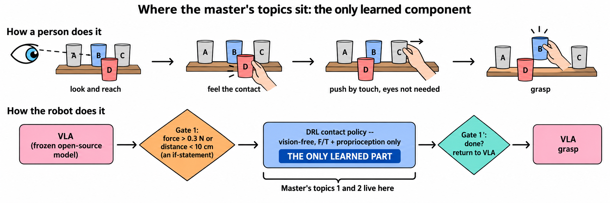
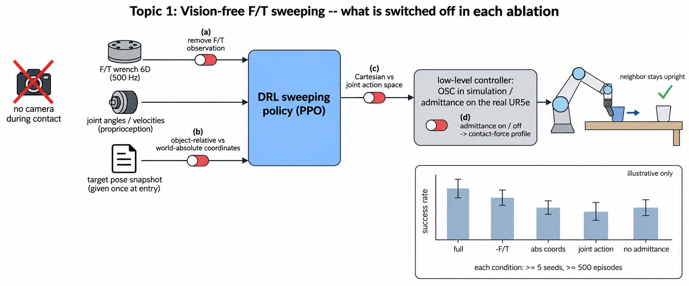
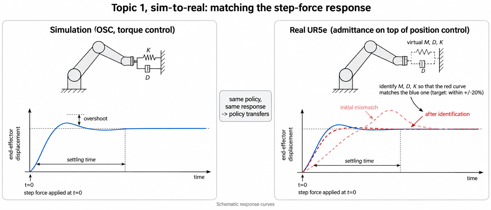
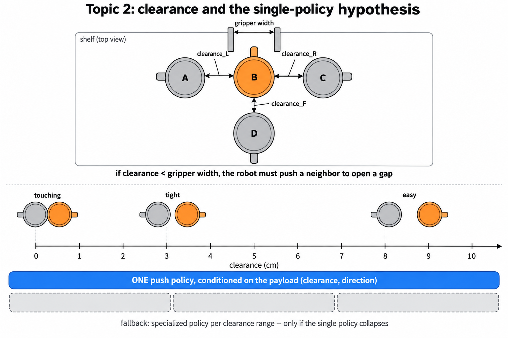
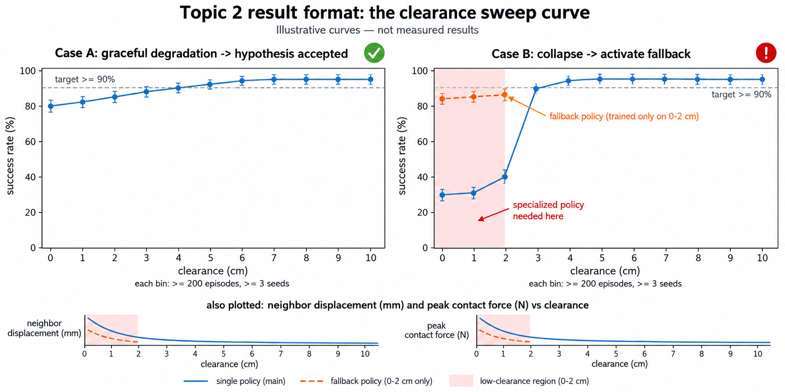
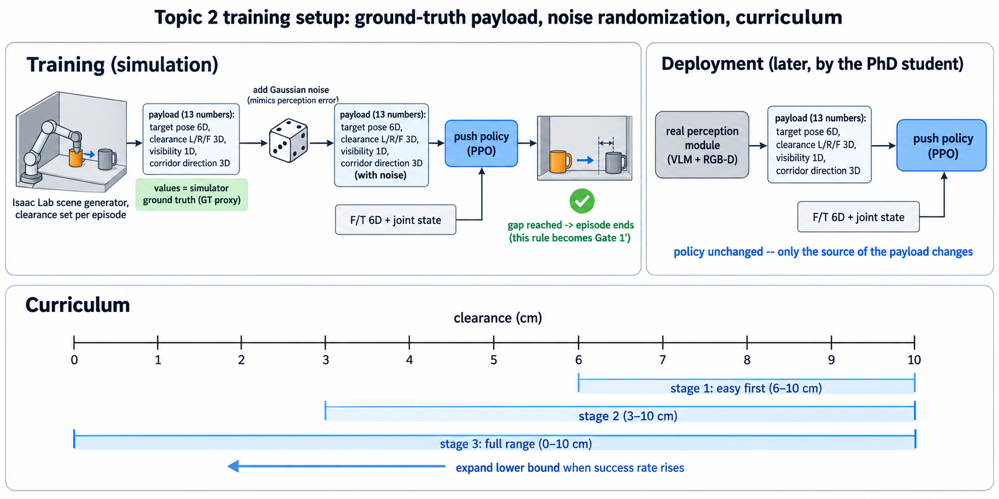
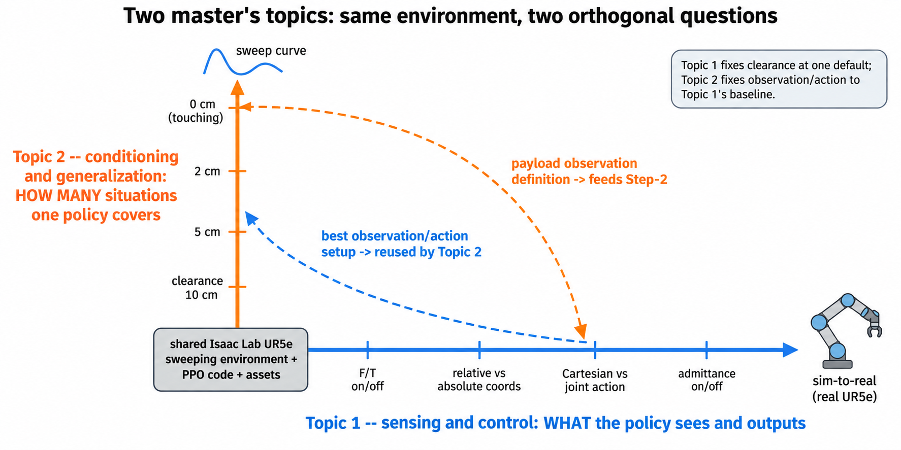

# 석사과정 연구주제 — 하위단 강화학습 (Low-level DRL)

| 항목 | 내용 |
|---|---|
| 문서 ID | `topics/msc-lowlevel-rl-topics` |
| 현재 리비전 | **r3** (2026-09-10) |
| 상태 | 초안 — 교수님 검토 대기 |
| 선행 연구 | 김태호 외, "Robust Sweeping in Cluttered Shelves: Safe-Contact Reward Design and Physics-Tuned Sim-to-Real Transfer" (IEEE Access 투고, 2026-09-01 리젝) — [원고 PDF](https://github.com/dhlee04/contact-manipulation-research/blob/main/%EA%B9%80%ED%83%9C%ED%98%B8___Access__Sweeping_in_cluttered_shelves_with_DRL.pdf), 리뷰어 지적은 부록 C |
| 선행 설계 문서 | [docs/01_differentiation.md](https://github.com/dhlee04/contact-manipulation-research/blob/main/docs/01_differentiation.md) · [docs/05_lowlevel_workflows.md §5.3](https://github.com/dhlee04/contact-manipulation-research/blob/main/docs/05_lowlevel_workflows.md) · [docs_2/01-1_obs_vla_design.md](https://github.com/dhlee04/contact-manipulation-research/blob/main/docs_2/01-1_obs_vla_design.md) (2026-06~07, 하위단 DRL 개선 아이디어) · [irol/adaptive_executor_routing_protocol.md](../adaptive_executor_routing_protocol.md) (상위단 멀티스텝 라우팅, 박사과정 담당) |
| 근거 문서 | [contact-manipulation-research/roadmap](https://github.com/dhlee04/contact-manipulation-research/tree/main/roadmap) — `research_roadmap.md`, `vlm_perception_model_evaluation.md`, `vlm_manipulation_subgoal_evaluation.md`, `imsi.md` (커밋 `a6b649d` 기준) |
| 그림 | `images/msc_topics_fig1~7` 생성 완료(2026-09-10). 그림 8(시작 포즈 타원체)은 부록 B 프롬프트로 생성 예정 |

## 리비전 이력

| rev | 날짜 | 변경 | 작성 |
|---|---|---|---|
| r1 | 2026-09-10 | 최초 작성. 로드맵 4편 검토 후 하위단 강화학습 주제 2건 추천 | 미카엘(로보틱스연구원) |
| r2 | 2026-09-10 | 석사 연구원이 바로 읽을 수 있게 배경 개념·주제별 상세 절차·성공 기준·타임라인을 풀어 씀. 그림 7장 프롬프트 추가(부록 B). r1은 검토 전 초안이라 절 구조를 재편함(이후 리비전부터 절 번호 고정) | 미카엘(로보틱스연구원) |
| r3 | 2026-09-10 | 교수님 지적 반영: 김태호 정책이 **원점(home) 고정 시작**에 묶인 구조적 원인(잔차 action `θ_init + α·a`, 위상 보상)을 원고에서 확인해 §4.1에 추가. 주제 ①에 **S1.5 시작 포즈 랜덤화(handoff 불확실성 타원체)**와 ablation ⓔ(고정 시작 vs 타원체 시작) 추가, 성공 기준·타임라인 갱신. 주제 ② T1의 페이로드 잡음을 등방 가우시안 → 공분산 타원체로 정정. 상위단(박사) 멀티스텝 라우팅과의 접점을 §6에 명시. 부록 C(선행 논문 요약·리뷰어 지적 6건), 그림 8 프롬프트 추가 | 미카엘(로보틱스연구원) |

> 리비전 규칙: 파일명은 고정하고 이 표와 상단 "현재 리비전"만 올린다. 본문 절 번호는 r2 이후 바꾸지 않는다(삭제 시 "(r_N에서 삭제)"로 남김). 큰 방향 전환은 r_N → r_(N+1)로, 오탈자·표현 수정은 리비전을 올리지 않고 커밋만 한다.

---

## 0. 이 문서를 읽는 법

- **교수님**: §1(요약)과 §8(유의할 점)만 보셔도 결정에 충분하다. 나머지는 학생 설명용이다.
- **석사 연구원**: §2(배경 개념)를 먼저 읽고 §4·§5(주제 상세)로 간다. 로드맵 원문은 이 문서를 읽은 뒤에 보는 편이 빠르다.
- 굵은 글씨의 용어는 §2에 쉬운 설명이 있다.

---

## 1. 요약

우리 랩의 2년 로드맵은 "선반 위에 다른 물건들과 붙어 있거나 가려진 물건을, 말로 지정하면 옆 물건을 넘어뜨리지 않고 꺼내는 로봇"을 만드는 것이다. 이 시스템에서 **학습이 필요한 부품은 딱 하나, 접촉 구간을 담당하는 강화학습(DRL) 정책**이다. 석사과정 연구원 두 명에게는 이 하나의 부품을 두 방향에서 만드는 주제를 준다.

| | 주제 ① | 주제 ② |
|---|---|---|
| 한 줄 | 카메라 없이 **힘 센서만으로**, 그리고 **공간상 어느 위치에서 시작하든** 물건을 안전하게 미는 정책을 만들고, 무엇이 그 성능을 만드는지 실험으로 밝힌 뒤 실제 로봇에 옮긴다 | **틈의 너비가 얼마든** 하나의 정책으로 밀 수 있는지, 틈 너비를 바꿔 가며 성공률 곡선을 그려 검증한다 |
| 로드맵 위치 | Step-1 | Step-4의 DRL 절반 (+ Step-2 하위단) |
| 질문의 성격 | 센싱·제어 축 — "힘만으로 되는가" | 조건화·일반화 축 — "정책 하나가 얼마나 넓게 되는가" |
| 결과물 | 성공률 ≥ 90%, 이웃 전도율 ≤ 5%, F/T 기여 정량, 시작 오프셋 대비 성공률 곡선, 실기 부분 검증 | clearance–성공률 스윕 곡선 한 장, 폴백 필요 여부 판정 |
| 논문 | RA-L 또는 IROS | IROS/ICRA, 또는 박사 통합 논문(CoRL/RSS)의 핵심 실험 절 |

두 주제는 **같은 시뮬레이션 환경**(Isaac Lab UR5e sweeping)을 쓰지만 묻는 질문이 달라 기여가 겹치지 않는다(§6, 그림 7).

---

## 2. 배경 개념 — 쉬운 설명

### 2.1 전체 시스템을 한 장면으로 (그림 1)



선반에서 컵 B를 꺼내고 싶은데 좌우에 A·C, 앞에 D가 붙어 있다. 사람이라면 (1) 눈으로 B를 찾고 손을 가져간 뒤, (2) 손이 물건에 닿는 순간부터는 **눈보다 손끝 감각**으로 옆 물건을 살살 밀어 틈을 만들고, (3) 틈이 생기면 잡는다. 로드맵의 설계가 정확히 이것이다.

| 사람 | 로봇 (로드맵) | 학습? |
|---|---|---|
| 눈으로 찾고 손 가져가기 | **VLA**(vision-language-action 모델, 공개 모델을 그대로 씀) | ✗ |
| "이제 손이 닿았다" 느끼기 | **Gate 1** — 힘이 0.3 N 넘거나 거리 10 cm 안이면 켜지는 if문 | ✗ |
| 손끝 감각으로 살살 밀기 | **DRL 접촉 정책** — 카메라 없이 힘 센서로만 동작 | **✓ (유일)** |
| 틈이 생겼으면 잡기 | 다시 VLA | ✗ |

석사 주제는 세 번째 줄, 즉 "손끝 감각으로 살살 밀기"에 해당한다.

### 2.2 용어

| 용어 | 쉬운 뜻 | 이 연구에서의 의미 |
|---|---|---|
| **F/T 센서** (force/torque) | 로봇 손목에 달린 "힘 저울". 손끝에 걸리는 힘 3방향 + 비틀림 3방향 = 6개 숫자를 초당 500번 준다 | 접촉 구간에서 정책이 보는 **거의 유일한 감각** |
| **고유수용감각** (proprioception) | 눈 감고도 내 팔이 어디 있는지 아는 감각 | 관절 각도·속도(엔코더 값). F/T와 함께 정책 입력 |
| **vision-free** | 접촉 중에는 카메라를 **안 본다** | 손이 물건을 가리는 순간 카메라는 오히려 방해가 되고, 힘이 접촉을 더 빨리 알려주기 때문(로드맵 P5). 진입 순간 받은 목표 위치 한 번만 기억하고 나머지는 힘으로 판단 |
| **sweeping** | 물건을 잡지 않고 옆으로 **밀어 옮기기** | 우리 랩이 이미 논문(리젝, 재투고 예정)까지 쓴 기본 동작 |
| **clearance** (여유 간격) | 목표 물건과 옆 물건 사이 **틈의 너비**(m) | 그리퍼 폭보다 좁으면 밀어서 벌려야 한다. 주제 ②의 핵심 변수 |
| **페이로드** (payload) | VLA/인지 모듈이 DRL에게 넘겨주는 **쪽지 한 장**(약 13개 숫자) | 목표 위치 6D + 좌·우·앞 clearance 3D + 가시율 1D + 진입 통로 방향 3D |
| **GT proxy** | 학습 때는 인지 모듈 대신 **시뮬레이터가 아는 정답값**을 쪽지에 적어 줌 | 덕분에 인지 모듈이 없어도 하위단 학습을 먼저 할 수 있다 |
| **도메인 랜덤화** (DR) | 매 에피소드 물건 위치·마찰·질량·센서 잡음을 **일부러 흔들어** 학습 | 시뮬→실기 이전과 일반화의 기본 기법 |
| **커리큘럼** | 쉬운 문제부터 시작해 점점 어렵게 | 넓은 틈 → 좁은 틈 순으로 학습 |
| **OSC / admittance** | 로봇을 "힘을 받으면 그만큼 물러나는 스프링-댐퍼"처럼 움직이게 하는 제어기 | 시뮬은 OSC(토크 제어), 실기 UR5e는 토크 인터페이스가 없어 admittance(위치 제어 위에 가상 스프링)를 쓴다. 이 둘의 반응을 맞추는 것이 sim-to-real의 핵심 |
| **M·D·K** | admittance 제어기의 세 상수 — 가상 질량·감쇠·강성 | "얼마나 무겁게/끈적하게/뻣뻣하게 반응하느냐". 시뮬 응답과 같아지도록 값을 **식별**한다 |
| **ablation** | 부품을 하나씩 빼 보고 성능이 얼마나 떨어지는지 재는 실험 | "F/T가 정말 필요한가"를 증명하는 유일한 방법 |
| **Gate 1′** (복귀 판정) | "밀기 끝났다, 다시 VLA에게 넘겨라"를 정하는 규칙 | 목표 clearance 도달 / N스텝 진전 없음 / 타임아웃 |
| **handoff 포즈** | 상위단(모션 플래너·VLA)이 로봇 손을 물체 근처까지 데려다 놓고 DRL에게 넘기는 순간의 손 위치·자세 | 상위단은 물체 pose를 정확히 모르므로 이 위치는 매번 조금씩 다르다. DRL은 **여기서부터** 시작해야 한다 |
| **불확실성 타원체** | "정답은 이 근처 어딘가"를 나타내는 타원 모양의 확률 구름(공분산 행렬) | 물체 pose 추정 오차 때문에 handoff 시점의 **물체 기준 손 상대 포즈**가 타원체 안 어딘가에 있다. 방향마다 오차 크기가 다르므로(깊이 방향이 더 큼) 구가 아니라 타원체다. 학습 때 시작점을 이 타원체에서 뽑는다 |

### 2.3 왜 "학습은 하나뿐"이 중요한가

VLA 같은 대형 모델을 강화학습으로 다시 학습시키는 최신 연구들(VLA-RL, ConRFT 등)은 GPU 수십 장이 필요하다. 우리는 GPU 2대다. 그래서 대형 모델은 얼려 두고(frozen), **작은 DRL 정책 하나만 시뮬레이션에서 학습**한다. 이 정책이 좋아야 시스템 전체가 성립하므로, 석사 주제는 "부속 작업"이 아니라 **프로젝트의 유일한 학습 부품을 만드는 일**이다.

---

## 3. 후보 검토

로드맵에서 하위단 강화학습으로 성립하는 부분을 전부 뽑아 4개월 석사 일정에 맞는지 본다.

| # | 후보 | 로드맵 위치 | 석사 적합성 | 판단 |
|---|---|---|---|---|
| A | Vision-free F/T 단일접촉 sweeping — 임의 시작 포즈 + ablation + sim-to-real | Step-1 | 기존 환경 위에서 바로 착수, 리젝 논문 리뷰어 지적과 직결, 상위단 멀티스텝 라우팅이 요구하는 "임의 handoff 포즈 진입" 확보 | **주제 ①** |
| B | Clearance 조건부 단일 push 정책 — 전 범위 스윕·커리큘럼 | Step-4의 DRL 절반 | GT proxy로 인지 모듈 없이 성립, 결과가 곡선 한 장 | **주제 ②** |
| C | Goal-conditioned sweeping (방향·거리 조건화) | Step-2 하위단 | B에 포함 | B에 흡수 |
| D | 다중접촉 contact attribution | Step-3 | 미해결 난제(손목 F/T는 합력만 측정), 실패 시 촉각 센서 필요. 연구원 C(1년) 배정 | 제외 |
| E | Grasp 후 추출(extraction) 접촉 정책 | Step-5 ④ | grasp 통합이 전제, 2027 이후 | 제외 |
| F | Gate 1′ 규칙·option/semi-MDP 정식화 | §2.4, C2 | 이론 작업, 포스닥 E 배정 | 제외 |
| G | OSC ↔ admittance M·D·K 식별 | C8 | 단독 주제로는 작음 | A에 포함 |

---

## 4. 주제 ① — Vision-free F/T 단일접촉 Sweeping: 임의 시작 포즈, ablation, sim-to-real

### 4.1 문제를 쉽게

"눈을 가린 채 손끝 힘만으로 선반 위 컵을 옆으로 10 cm 밀어라. 단, 옆 컵을 넘어뜨리면 실패. 그리고 **손이 어디에 놓인 채로 시작하든** 해내라." 이것을 시뮬레이션에서 강화학습으로 배우게 하고, **① 정말 힘 센서 덕분에 되는 것인지**, **② 시작 위치가 달라져도 되는지**를 실험으로 증명한 뒤, **③ 실제 UR5e에서도 같은 반응이 나오게** 제어기를 맞춘다.

**선행 연구(김태호)가 못 하는 것 — 원점에서만 시작한다.** 원고를 보면 정책의 action이 초기 관절 자세에 대한 잔차다: `u = θ_init + α·a` (식 2, α = 0.5). 관측의 관절 위치·속도도 "initial state 기준 상대값"이고(Table 2), 보상은 Reaching → Sweeping → Homing의 위상 구조로 마지막에 **θ_init로 되돌아오게** 설계돼 있다(Table 3). 즉 이 정책은 "정해진 home 자세에서 출발해 물체까지 가서 밀고 home으로 복귀"하는 **한 덩어리 동작**을 배운 것이지, 상위단이 손을 물체 근처 임의의 위치에 데려다 놓고 "여기서부터 밀어라"라고 넘기는 상황을 배운 적이 없다. 물체 위치는 선반 전체에서 랜덤화했지만(Table 10: 물체 종류·방향·폭·스폰 위치·pose 잡음) **손의 시작 위치는 한 번도 랜덤화하지 않았다.** 그래서 상위단(박사과정, 멀티스텝 라우팅)이 "일반 모션제어로 접근 → DRL로 접촉"을 하려면 이 정책은 그대로 쓸 수 없다. 이 한계를 없애는 것이 이 주제의 첫 번째 기여다.

### 4.2 왜 이 주제인가

1. **이미 돌아가는 환경이 있다.** Isaac Lab의 `Isaac-Sweep-Object-UR5e-Random-v0` 태스크와 PPO 파이프라인(ENV_2.md)이 준비돼 있어 첫 주부터 학습을 돌릴 수 있다. 4개월 안에 논문까지 가려면 이것이 필수 조건이다.
2. **리젝된 논문([원고 PDF](https://github.com/dhlee04/contact-manipulation-research/blob/main/%EA%B9%80%ED%83%9C%ED%98%B8___Access__Sweeping_in_cluttered_shelves_with_DRL.pdf), 부록 C)의 리뷰어 지적이 그대로 실험 목록이다.** IEEE Access 심사에서 받은 지적 — ③ "안전 접촉"의 정의가 불명확, ④ 시행 수 부족·통계 검정 없음, ⑥ SysID/DR 개별 ablation 없음 — 은 아래 4.3의 실험을 하면 전부 답이 된다. 즉 이 주제의 결과는 곧 **재투고 원고**다.
3. **프로젝트의 관문이다.** 로드맵은 "성공률 ≥ 90%, 전도율 ≤ 5%, F/T 기여 입증"을 다음 단계(Step-3·4) 진입 조건으로 못박았다. 이 학생의 숫자가 랩 전체의 다음 단계를 연다.
4. **상위단과의 인터페이스를 이 주제가 만든다.** 박사과정(최해겸)의 멀티스텝 라우팅([adaptive_executor_routing_protocol.md](../adaptive_executor_routing_protocol.md))은 "모션 플래너가 손을 물체 근처까지 보내고, 접촉 구간만 DRL이 맡는다"는 구조다. 이것이 성립하려면 DRL이 **임의 handoff 포즈에서 진입**할 수 있어야 하고, 그 handoff 포즈에는 물체 pose 추정 오차가 섞여 있다. S1.5가 바로 그 요구조건을 정책에 심는 단계다.

### 4.3 구체적으로 무엇을 하나 (그림 2·8)



| 단계 | 할 일 | 산출물 |
|---|---|---|
| S0 재현 | 기존 sweeping 정책을 원본 에셋으로 다시 학습해 팀 결과와 같은지 확인. 관측 벡터 차원을 문서화(리뷰어 지적 ①: 6-DoF인데 관절 관측 8차원인 이유를 명시) | 기준선(baseline) 성능표 |
| S1 "안전 접촉" 정의 | 리뷰어 지적 ③ 대응. "3 cm 거리"가 아니라 **실제 접촉력·이웃 물체 기울기**로 안전을 정의하고 보상·평가 지표를 그 정의에 맞춘다 | 정의 + 지표 |
| **S1.5 시작 포즈 랜덤화** (그림 8) | 선행 연구의 "원점 고정 시작"을 없앤다. ⓐ action을 `θ_init` 잔차가 아니라 **현재 EEF 기준 Cartesian 변위**로 바꾸고(ablation ⓒ와 연동), 관측을 **물체 기준 상대 좌표**로 바꾼다(ablation ⓑ). ⓑ 에피소드마다 EEF 시작 포즈를 **물체 기준 handoff 불확실성 타원체**에서 샘플링한다 — 위치 공분산(예: 깊이 방향 σ 5 cm, 좌우 3 cm, 높이 2 cm) + 자세 공분산(요 ±15°)을 두고, 학습은 2σ, 평가는 3σ까지. Reaching·Homing 위상 보상은 제거하고 접촉·밀기 구간만 남긴다 | 시작 오프셋(타원체 마할라노비스 거리) 대비 성공률 곡선 |
| S2 ablation ⓐ F/T 유무 | F/T 6D를 관측에서 빼고 학습 → 성공률·전도율·접촉력 최대치 비교 | 표·박스플롯 |
| S3 ablation ⓑ 좌표계 | 목표 물체 기준 상대좌표 vs 월드 절대좌표 | 표 |
| S4 ablation ⓒ 행동공간 | Cartesian(EEF 속도/변위) vs joint(관절 속도) | 표 |
| S5 ablation ⓓ admittance 유무 | 하위 제어기의 순응성을 끄고 켰을 때 접촉력 프로파일(시간-힘 곡선) 비교 | 곡선 |
| S5.5 ablation ⓔ 시작 분포 | 원점 고정 시작으로 학습한 정책 vs 타원체 시작으로 학습한 정책을 **같은 타원체 시작 조건**에서 평가. 선행 연구 대비 차별점을 수치로 보이는 실험 | 표 + 곡선 |
| S6 통계 | 각 조건 seed ≥ 5, 평가 에피소드 ≥ 500, 신뢰구간·검정(리뷰어 지적 ④) | 통계표 |
| S7 sim-to-real | 실기 UR5e에 계단 힘(step force)을 주고 응답을 기록 → 시뮬 OSC 응답과 같아지도록 M·D·K 식별(docs 09·10 매뉴얼) | M·D·K 값 + 응답 비교 그림(그림 3) |
| S8 실기 부분 검증 | 학습 정책을 실기에 올려 단일 물체 sweeping 20~30회. 절반은 home에서, 절반은 **임의 handoff 포즈**(사람이 손으로 옮겨 놓거나 플래너로 보낸 위치)에서 시작 | 성공률, 실패 사례 |



### 4.4 성공 기준

| 지표 | 기준 | 출처 |
|---|---|---|
| 시뮬 성공률 | ≥ 90% | 로드맵 §4 Step-1 |
| 이웃 물체 전도율 | ≤ 5% | 〃 |
| F/T ablation | F/T 제거 시 성공률 **유의하게** 하락(검정 p < 0.05) | 〃 "F/T obs 기여 정량 입증" |
| 임의 시작 | 타원체 2σ 안 어느 시작점에서도 성공률 ≥ 85%, 3σ에서 완만한 저하(급락 없음). 원점 고정 학습 정책은 같은 조건에서 유의하게 낮아야 차별점 성립 | 이 문서 S1.5·S5.5 (수치는 착수 후 조정) |
| sim-to-real | 계단 힘 응답의 정착시간·오버슈트가 시뮬과 ±20% 이내 | docs 09 기준 |

### 4.5 예상되는 어려움

- **원본 에셋**: 물체 6종 중 Cup_4·Mug_2·Mug_3가 아직 플레이스홀더다. 착수 1주 내 확보(로드맵 R2).
- **GPU 메모리**: 팀 기본 `num_envs 4096`은 24 GB 기준. 12 GB 카드는 1024부터.
- **실기 시간**: 로봇 1대를 박사·다른 과제와 나눠 쓴다. S7·S8은 11월 이후 주 단위 슬롯을 미리 잡는다.

---

## 5. 주제 ② — Clearance 조건부 단일 push 정책: 전 범위 스윕과 커리큘럼

### 5.1 문제를 쉽게 (그림 4)



목표 컵과 옆 컵 사이 틈(clearance)이 **0 cm(딱 붙음)부터 10 cm(넉넉함)까지** 어떤 값이든 올 수 있다. 질문은 하나다: **"밀기 정책 하나로 이 모든 경우를 다 처리할 수 있는가, 아니면 좁은 틈 전용 정책을 따로 둬야 하는가?"**

로드맵은 "하나로 된다"에 걸었다(P4). 이것이 무너지면 정책을 여러 개 두고 고르는 라우팅이 필요해져 설계가 복잡해진다(폴백, §2.6). 그래서 이 가설은 **통합 전에 미리 확인**해야 하며, 그 일이 이 주제다.

### 5.2 왜 이 주제인가

1. **로드맵이 스스로 "가장 강력한 지렛대"로 꼽은 실험이다.** 결과가 "clearance를 가로축으로 한 성공률 곡선 한 장"이라 심사위원이 한눈에 이해한다. 랩 규모(GPU 2대·로봇 1대)로 대형 랩과 겨루는 전략이 바로 "한 축을 깊게 스윕"이다(C7 대응).
2. **인지 모듈 없이 순수 하위단으로 성립한다.** 학습 때는 시뮬레이터 정답값(GT proxy)을 페이로드에 넣으므로 VLA·VLM·카메라 파이프라인이 필요 없다. 석사가 혼자 끝낼 수 있는 범위다.
3. **가장 큰 리스크를 가장 싸게 없앤다.** "단일 정책 가설 실패"(C3·R4)를 박사 통합 전에 알면 폴백 설계로 갈아탈 시간이 생긴다.
4. Step-2의 하위단 절반(방향·거리에 조건화된 goal-conditioned 정책)도 자연스럽게 포함된다.

### 5.3 구체적으로 무엇을 하나 (그림 5·6)





| 단계 | 할 일 | 산출물 |
|---|---|---|
| T0 씬 생성기 | 기존 Random task를 확장해 **clearance를 직접 지정**해 물체를 스폰하는 기능 추가(좌·우·앞 세 방향). 학부생 F의 하네스가 준비되면 그것으로 교체 | `clearance` 파라미터화 환경 |
| T1 페이로드 관측 | 정책 입력에 GT proxy 페이로드(목표 pose 6D, clearance 3D, 가시율 1D, 통로 방향 3D)를 붙이고, 각 값에 잡음 DR을 건다(인지 오차 흉내). 목표 pose의 잡음은 등방 가우시안이 아니라 **주제 ① S1.5와 같은 공분산 타원체**(깊이 방향이 더 큼)로 두어 두 주제가 같은 불확실성 모델을 공유한다 | 관측 정의서(= 페이로드 규격 v1의 "소비자 측" 초안) |
| T2 보상·종료 | 보상 = 목표 clearance 확보(+) + 이웃 물체 안정(−기울기·변위) + 접촉력 상한(−초과분). 종료 = 목표 clearance 도달 **또는** N스텝 진전 없음 **또는** 타임아웃 — 이것이 그대로 Gate 1′ 규칙이 된다 | 보상 표 |
| T3 DR + 커리큘럼 | clearance를 [0, 0.10] m 전 범위에서 랜덤 샘플. 커리큘럼: 처음엔 넓은 쪽만 → 성공률이 오르면 하한을 점점 0으로 | 학습 곡선 |
| T4 스윕 평가 | 학습된 정책 하나를 clearance 0/1/2/…/10 cm 구간마다 ≥ 200 에피소드 평가 → **성공률·이웃 변위·최대 접촉력 곡선** | 그림 5 형태의 곡선 |
| T5 분기 판정 | 곡선이 완만하면 가설 채택. 특정 clearance 이하에서 **급락**하면 그 구간 전용 정책을 추가 학습해 비교(폴백 ablation) | 판정 + 폴백 결과 |
| T6 (선택) 방향·거리 조건화 | 페이로드의 통로 방향을 바꿔도 같은 정책이 따라오는지(Step-2 하위단) | 표 |

### 5.4 성공 기준

| 지표 | 기준 |
|---|---|
| 넓은 clearance(≥ 5 cm) 성공률 | ≥ 90% (주제 ①과 같은 수준) |
| 곡선 형태 | 인접 구간 간 성공률 하락 ≤ 10%p면 "완만", 어느 구간에서 > 25%p 떨어지면 "급락"으로 정의(수치는 착수 후 조정) |
| 폴백 판정 | 급락 시 특화 정책이 그 구간에서 단일 정책보다 유의하게 나은지 검정 |
| 통계 | 구간당 ≥ 200 에피소드, seed ≥ 3 |

### 5.5 예상되는 어려움

- **씬 생성기가 곧 실험의 절반이다.** T0가 늦으면 전부 밀린다. 첫 3주를 여기에 쓴다.
- **clearance 0 근처는 물리 시뮬레이션이 불안정**할 수 있다(관통·떨림). 접촉 파라미터 튜닝이 필요하다.
- **보상 설계의 균형**: 안정 항을 너무 키우면 정책이 아예 밀지 않는 "소극적 해"에 빠진다. 접촉력 상한과 함께 조정한다.

---

## 6. 두 주제의 관계 (그림 7)



| | 주제 ① | 주제 ② |
|---|---|---|
| 공유 | 같은 Isaac Lab 환경, 같은 PPO 코드, 같은 에셋 | |
| 축 | **무엇을 보고 미는가** (관측·행동·제어기) | **어떤 상황까지 미는가** (틈 너비 조건화·일반화) |
| 고정하는 것 | clearance는 기본값 하나 | 관측·행동공간은 ①의 최선 조합을 그대로 사용 |
| 주고받는 것 | ①의 ablation 결과(최선 관측·행동공간)와 **handoff 불확실성 타원체 정의** → ② | ②의 페이로드 관측 정의 → ①의 후속(Step-2) |
| 실기 | 사용 (S7·S8) | 시뮬로 종료 |

①이 먼저 관측·행동공간을 확정하면 ②가 그것을 쓰는 순서가 이상적이지만, 4개월 안에 순차로는 불가능하므로 **①의 S0 기준선 설정을 ②가 공유**하고 이후는 병렬로 간다.

**상위단(박사과정)과의 접점.** 최해겸의 멀티스텝 라우팅은 "선반 깊숙한 목표까지 여러 주변 물체를 지나 들어가는 계획을 세우고, 스텝마다 일반 모션제어와 DRL을 골라 실행"하는 구조다. 하위단이 상위단에 약속해야 하는 것은 두 가지뿐이다 — (i) **어떤 handoff 포즈에서든 진입**해 sweep/push를 F/T만으로 끝낸다(주제 ① S1.5), (ii) **틈 너비가 얼마든** 페이로드 하나로 동작한다(주제 ②). 이 두 약속이 곧 상위단이 DRL을 "실행기 하나"로 취급할 수 있는 조건이다.

---

## 7. 제외한 후보와 이유

- **Step-3 contact attribution**: 손목 F/T는 여러 물체에 동시에 닿아도 합쳐진 힘 하나만 준다. 이를 풀지 못하면 촉각 센서를 달아야 하는 "미해결 난제"라 4개월 석사에겐 위험하다. 로드맵도 연구원 C(1년)에게 배정했다.
- **Step-5 grasp 후 추출 정책**: 하위단 RL이긴 하지만 grasp 통합이 전제라 2027년 이후 일정이다.
- **Step-2 페이로드 추출 파이프라인**(인지): 이번 방침(하위단) 밖이다.

---

## 8. 유의할 점 (교수님 결정 필요)

1. **인지 인터페이스 담당 공백.** 로드맵 §5.1은 석사 B를 Step-2(페이로드 추출 파이프라인 + 추출 방식 3종 비교)에 배정했다. 둘 다 하위단으로 돌리면 **2026-10-31 페이로드 규격 v1 동결**과 grounding/RGB-D 파이프라인(`vlm_perception_model_evaluation.md`) 담당이 빈다. 포스닥 E + 학부생 F로 옮기거나, 주제 ② 학생의 T1(정책이 소비하는 쪽 관측 정의)을 규격 초안으로 삼는 절충이 필요하다.
2. **씬 생성기 의존.** 주제 ②는 학부생 F의 하네스가 늦으면 T0를 자체 조달한다. 두 사람이 같은 것을 두 번 만들지 않도록 첫 주에 역할을 나눈다.
3. **실기 슬롯.** 주제 ①만 실기를 쓴다. 논문 시즌(2027.01) 우선권은 ①에 둔다.
4. **에셋.** Cup_4·Mug_2·Mug_3 원본 확보가 두 주제 공통 선행 조건이다(R2).

---

## 9. 4개월 타임라인 (안)

| 월 | 주제 ① | 주제 ② | 공통 |
|---|---|---|---|
| 2026-09 | S0 재현, S1 안전 접촉 정의, S1.5 시작 포즈 랜덤화 착수 | T0 씬 생성기, T1 페이로드 관측 | 에셋 확보, 관측·행동공간 기준선·불확실성 타원체 정의 합의 |
| 2026-10 | S2~S5.5 ablation 5종 | T2 보상·종료, T3 DR+커리큘럼 학습 | 페이로드 규격 v1 동결(10/31) 기여 |
| 2026-11 | S6 통계, S7 M·D·K 식별 | T4 스윕 평가, T5 분기 판정 | 중간 발표 |
| 2026-12 | S8 실기 검증, 논문 초고 | T6(선택), 논문 초고 | 학위논문 심사(12/20) |
| 2027-01 | 논문 완성·투고 | 논문 완성·투고 | |

---

## 10. 다음 단계

- [ ] 교수님 주제 확정 (①·② 승인 또는 수정)
- [ ] 학생 배정
- [x] 부록 B 프롬프트로 그림 7장 생성 → `topics/images/` (2026-09-10)
- [ ] 그림 8(시작 포즈 타원체) 생성 → `topics/images/msc_topics_fig8_start_pose_ellipsoid.png`
- [ ] 학생별 실행 계획 문서 → `topics/msc-lowlevel-rl-plan-<학생>.md`
- [ ] §8-1 인지 인터페이스 담당 재배정 결정

---

## 부록 A. 로드맵 원문 대응표

| 이 문서 | 로드맵 원문 |
|---|---|
| §2.1 시스템 한 장면 | `research_roadmap.md` §1.1 그림 읽기, §1.2 대상 시나리오 |
| §2.2 페이로드 | §2.3 축 2, §5.3 규격 v1 |
| §2.2 Gate 1 / Gate 1′ | §2.2, §2.4 |
| §2.3 학습은 하나뿐 | §2.7, P2 |
| §4 주제 ① | §4 Step-1, C8, docs 09·10·11; 시작 포즈 랜덤화는 docs/04 §4.3·docs/05 §5.3 Step 4·docs_2/01-3 공통 DR 표(±10 cm·±15°)의 확장 |
| §5 주제 ② | §4 Step-4, §2.6 폴백, P4, C3, R4 |
| §7 제외 | §4 Step-3, C4, §1.2 ④⑤ |
| §8 유의 | §5.1 인력, §5.3 인터페이스 동결, R1·R2·R5 |

---

## 부록 B. 그림 생성 프롬프트

로드맵 문서의 그림과 같은 스타일(flat vector, 흰 배경, 공학 도해)로 맞췄다. 생성본은 `topics/images/msc_topics_figN_*.png`에 있고 본문에 삽입돼 있다. 재생성 시 같은 파일명으로 덮어쓴다. 색 규칙: 분홍 = VLA, 주황 = Gate 1, 파랑 = DRL 정책, 청록 = Gate 1′, 빨강 = 안전장치·실패, 초록 = 성공·정답.

<details>
<summary>그림 1 — 시스템 한 장면: 사람의 동작 vs 로봇의 부품 (§2.1)</summary>

```
Create a clean two-row explainer diagram, flat vector illustration, white
background, engineering-teaching style, titled "Where the master's topics sit:
the only learned component".

Top row, labeled "How a person does it": four simple icons left to right
connected by arrows -- (1) an eye looking at a shelf with a cup B surrounded by
cups A, C and a front cup D, caption "look and reach"; (2) a hand touching cup D,
caption "feel the contact"; (3) a hand gently pushing cup C sideways with small
force arrows, caption "push by touch, eyes not needed"; (4) a hand grasping cup
B, caption "grasp".

Bottom row, labeled "How the robot does it", aligned under each icon: (1) a pink
rounded box "VLA (frozen open-source model)"; (2) an orange diamond "Gate 1:
force > 0.3 N or distance < 10 cm (an if-statement)"; (3) a blue rounded box
"DRL contact policy -- vision-free, F/T + proprioception only" with a bold badge
"THE ONLY LEARNED PART"; (4) a pink rounded box "VLA grasp". A teal diamond
"Gate 1': done? return to VLA" sits between (3) and (4).

Draw a bracket under box (3) with the label "Master's topics 1 and 2 live here".

Rounded rectangles, clean sans-serif labels, generous white space, minimal
clutter.
```

</details>

<details>
<summary>그림 2 — 주제 ①의 구조와 ablation 4종 (§4.3)</summary>

```
Create a clean technical block diagram, flat vector illustration, white
background, titled "Topic 1: Vision-free F/T sweeping -- what is switched off in
each ablation".

Center: a blue rounded box "DRL sweeping policy (PPO)". Into it, from the left,
three input arrows: "F/T wrench 6D (500 Hz)" from a small wrist-sensor icon,
"joint angles / velocities (proprioception)" from a small encoder icon, and
"target pose snapshot (given once at entry)" from a small note icon. A camera
icon on the far left is crossed out in red with the caption "no camera during
contact".

From the policy box, an output arrow to a gray box "low-level controller: OSC in
simulation / admittance on the real UR5e", then to a robot arm icon pushing a cup
on a shelf, with a neighbor cup that must not tip over (small green check mark
"neighbor stays upright").

Around the diagram, four numbered toggle switches with short labels showing what
each ablation removes or swaps:
(a) switch on the F/T arrow: "remove F/T observation";
(b) switch on the target-pose arrow: "object-relative vs world-absolute
coordinates";
(c) switch on the output arrow: "Cartesian vs joint action space";
(d) switch on the controller box: "admittance on / off -> contact-force
profile".

Bottom-right, a small results panel sketch: a bar chart with 5 bars labeled
"full, -F/T, abs coords, joint action, no admittance" and y-axis "success rate",
with error bars, caption "each condition: >= 5 seeds, >= 500 episodes".

Rounded rectangles, clean sans-serif labels, blue for the policy, gray for the
controller, red for the crossed-out camera.
```

</details>

<details>
<summary>그림 3 — Sim-to-real: OSC와 admittance의 계단 힘 응답 맞추기 (§4.3 S7)</summary>

```
Create a clean two-panel technical figure, flat vector illustration, white
background, titled "Topic 1, sim-to-real: matching the step-force response".

Left panel, "Simulation (OSC, torque control)": a small robot-arm icon with a
spring-damper symbol at the wrist, and below it a line plot of end-effector
displacement vs time responding to a step force applied at t=0 -- a solid blue
curve that rises, overshoots slightly, and settles. Annotate "settling time" and
"overshoot" with thin dimension arrows.

Right panel, "Real UR5e (admittance on top of position control)": the same
robot-arm icon with a virtual spring-damper drawn dashed, labeled "virtual M, D,
K", and the same kind of plot with a dashed red curve initially mismatched
(slower, more overshoot). A curved arrow labeled "identify M, D, K so that the
red curve matches the blue one (target: within +/-20%)" points from the mismatch
toward a second, aligned dashed red curve overlaid on the blue curve.

Between the panels, a small centered box: "same policy, same response -> policy
transfers".

Rounded panels, clean sans-serif labels, blue = simulation, red dashed = real
robot, minimal clutter.
```

</details>

<details>
<summary>그림 4 — clearance의 정의와 단일 정책 가설 (§5.1)</summary>

```
Create a clean top-view explainer diagram, flat vector illustration, white
background, titled "Topic 2: clearance and the single-policy hypothesis".

Top half: a top-down view of a shelf with target cup B (orange) in the center,
neighbor cups A (left) and C (right), and D in front. Three double-headed
dimension arrows show gaps: "clearance_L" between A and B, "clearance_R" between
B and C, "clearance_F" between D and B. A gripper outline (two parallel fingers)
hovers above with its width drawn as a dimension "gripper width"; a caption:
"if clearance < gripper width, the robot must push a neighbor to open a gap".

Bottom half: a horizontal axis labeled "clearance (cm)" from 0 to 10 with tick
marks. Above the axis, three small scene thumbnails at 0 cm ("touching"), 3 cm
("tight"), and 8 cm ("easy"). Spanning the whole axis, one long blue rounded bar
labeled "ONE push policy, conditioned on the payload (clearance, direction)".
Below it, a faded dashed alternative: three separate gray bars labeled "fallback:
specialized policy per clearance range -- only if the single policy collapses".

Rounded rectangles, clean sans-serif labels, orange = target, gray = neighbors,
blue = the single policy, dashed gray = fallback.
```

</details>

<details>
<summary>그림 5 — 스윕 곡선의 두 가지 결과: 완만 vs 급락 (§5.3 T4·T5)</summary>

```
Create a clean two-panel chart illustration, flat vector style, white background,
titled "Topic 2 result format: the clearance sweep curve".

Both panels share the same axes: x-axis "clearance (cm)" from 0 to 10, y-axis
"success rate (%)" from 0 to 100, with a light horizontal reference line at 90%
labeled "target >= 90%". Each data point has a small vertical error bar and a
caption under the axis "each bin: >= 200 episodes, >= 3 seeds".

Left panel, "Case A: graceful degradation -> hypothesis accepted": a solid blue
curve staying high (~95%) on the right and declining smoothly and gently toward
~80% at 0 cm. A green check badge in the corner.

Right panel, "Case B: collapse -> activate fallback": a solid blue curve staying
high until about 3 cm, then dropping sharply to ~30% below 2 cm. Shade the
collapse region (0-2 cm) in light red and label it "specialized policy needed
here". Add a dashed orange curve in that region rising back to ~85%, labeled
"fallback policy (trained only on 0-2 cm)". A red exclamation badge in the
corner.

Below both panels, a thin secondary axis sketch: "also plotted: neighbor
displacement (mm) and peak contact force (N) vs clearance".

Clean sans-serif labels, blue = single policy, orange dashed = fallback, light
red = collapse zone.
```

</details>

<details>
<summary>그림 6 — GT proxy 페이로드 + 도메인 랜덤화 + 커리큘럼 (§5.3 T1·T3)</summary>

```
Create a clean technical diagram, flat vector illustration, white background,
titled "Topic 2 training setup: ground-truth payload, noise randomization,
curriculum".

Left block, "Training (simulation)": a simulator icon labeled "Isaac Lab scene
generator, clearance set per episode" emits a small note card "payload (13
numbers): target pose 6D, clearance L/R/F 3D, visibility 1D, corridor direction
3D" with a tag "values = simulator ground truth (GT proxy)". A small dice icon
next to the card labeled "add Gaussian noise (mimics perception error)". The card
plus "F/T 6D + joint state" arrows feed a blue rounded box "push policy (PPO)".
From the policy, an arrow to a shelf scene where a neighbor cup is pushed and a
gap opens, with a green check "gap reached -> episode ends (this rule becomes
Gate 1')".

Right block, "Deployment (later, by the PhD student)": the same policy box, but
the note card now comes from a gray box "real perception module (VLM + RGB-D)",
with the caption "policy unchanged -- only the source of the payload changes".

Bottom strip, "Curriculum": a horizontal bar from 0 to 10 cm clearance; three
stages drawn as widening brackets: stage 1 covers 6-10 cm ("easy first"), stage
2 covers 3-10 cm, stage 3 covers 0-10 cm ("full range"), with an arrow "expand
lower bound when success rate rises".

Rounded rectangles, clean sans-serif labels, blue = policy, gray = perception,
green = success.
```

</details>

<details>
<summary>그림 7 — 두 주제의 관계: 같은 환경, 다른 축 (§6)</summary>

```
Create a clean conceptual diagram, flat vector illustration, white background,
titled "Two master's topics: same environment, two orthogonal questions".

Center: a single gray rounded box "shared Isaac Lab UR5e sweeping environment +
PPO code + assets". From it, two perpendicular axes drawn like a coordinate
system.

Horizontal axis pointing right, colored blue, labeled "Topic 1 -- sensing and
control: WHAT the policy sees and outputs". Along it, small tick labels: "F/T
on/off", "relative vs absolute coords", "Cartesian vs joint action", "admittance
on/off", ending with a small real-robot icon "sim-to-real (real UR5e)".

Vertical axis pointing up, colored orange, labeled "Topic 2 -- conditioning and
generalization: HOW MANY situations one policy covers". Along it, tick labels:
"clearance 10 cm", "5 cm", "2 cm", "0 cm (touching)", ending with a small
curve icon "sweep curve".

Two dashed arrows between the axes: one from the blue axis to the orange axis
labeled "best observation/action setup -> reused by Topic 2", and one from the
orange axis back to the blue axis labeled "payload observation definition ->
feeds Step-2".

A small note in the corner: "Topic 1 fixes clearance at one default; Topic 2
fixes observation/action to Topic 1's baseline."

Rounded rectangles, clean sans-serif labels, blue and orange axes, gray shared
box, minimal clutter.
```

</details>

<details>
<summary>그림 8 — handoff 불확실성 타원체에서의 시작 포즈 샘플링 (§4.3 S1.5)</summary>

```
Create a clean technical explainer diagram, flat vector illustration, white
background, titled "Topic 1, step S1.5: start anywhere -- sampling the handoff
pose from an uncertainty ellipsoid".

Left panel, "Prior work (fixed home start)": a side view of a shelf with a
target cup; a robot gripper drawn at one fixed "home" pose far from the cup,
with a single solid arrow path: home -> reach -> push -> back to home. Caption:
"policy action = theta_init + alpha * a; always starts and ends at home".
A small red label "cannot be entered mid-way by a planner".

Right panel, "This topic (start from any handoff pose)": the same shelf and
cup. Around the ideal contact pose next to the cup, draw a translucent blue
3D ellipsoid, elongated along the shelf depth direction and flatter vertically,
labeled "handoff uncertainty ellipsoid (covariance of the hand pose relative to
the object)". Inside and on the ellipsoid, scatter 6-8 small gripper icons at
different positions and slight yaw angles, each with a short blue arrow toward
the cup labeled once "push by F/T only". Two dashed contour rings labeled
"2 sigma (training)" and "3 sigma (evaluation)". Above the ellipsoid, a gray
arrow coming from off-panel labeled "upper level (motion planner / VLA) drops
the hand somewhere in here".

Bottom strip: a small line chart, x-axis "start offset (Mahalanobis distance,
sigma)" 0 to 3, y-axis "success rate (%)"; a solid blue curve staying above 85%
through 2 sigma and declining gently; a dashed gray curve labeled "policy
trained from fixed home" dropping steeply after 0.5 sigma.

Rounded shapes, clean sans-serif labels, blue = this topic, gray/red = prior
work, minimal clutter, teaching-figure style.
```

</details>

---

## 부록 C. 선행 논문 요약과 리뷰어 지적

**김태호·전하늘·민동규·이동훈, "Robust Sweeping in Cluttered Shelves: Safe-Contact Reward Design and Physics-Tuned Sim-to-Real Transfer"** — IEEE Access 투고(Access-2026-36124), 2026-09-01 리젝(재투고 불가, 타 저널 재투고 예정). [원고 PDF](https://github.com/dhlee04/contact-manipulation-research/blob/main/%EA%B9%80%ED%83%9C%ED%98%B8___Access__Sweeping_in_cluttered_shelves_with_DRL.pdf)

### C.1 무엇을 했나 (학생용 요약)

| 항목 | 내용 |
|---|---|
| 태스크 | UR5e + 그리퍼로 선반 위 물체를 옆으로 밀어(sweeping) 목표 위치로 옮김. 잡지 않음 |
| 관측 (35D) | 관절 위치 8·속도 6(초기 상태 기준 상대값), 이전 action 7, EEF pose 7, 물체 위치 3 + 폭 1(가우시안 잡음 주입), 목표 위치 3. **F/T 없음.** 좌표는 전부 base_link 기준 절대 |
| 행동 (7D) | 관절 6 + 그리퍼 1. 관절 action은 **초기 자세 θ_init에 대한 잔차** `u = θ_init + 0.5·a` |
| 보상 | 위상 구조: Reaching → Sweeping(3 cm 이내 접촉 지시 함수 + 속도 0.05~0.1 m/s 보상, 0.1 초과 페널티) → Homing(θ_init 복귀). 선반·물체 충돌 페널티, 매끄러움 페널티 |
| 종료 | 고속 접촉(C_unstable) 시 조기 종료 등 |
| Sim-to-real | 관절 강성·감쇠 SysID(궤적 오차 27→7 mm급) + DR(물체 종류·방향·폭·스폰 위치·pose 잡음) |
| 결과 | 실기 성공률 83.3%, 소요 14.6 s, 시뮬-실기 거리 오차 73.96% 개선 |

### C.2 이 주제와의 관계

- **원점 고정 시작**: action이 θ_init 잔차이고 Homing 보상이 θ_init 복귀를 강제 → 정책이 home 자세에 묶임. 물체 스폰 위치는 랜덤화했으나 **EEF 시작 포즈는 랜덤화 안 함**. → 주제 ① S1.5·S5.5
- **F/T 없음**: 접촉을 힘이 아니라 3 cm 거리와 물체 속도로 간접 판단 → 주제 ① S2(ablation ⓐ)
- **절대 좌표 관측**: 선반 구성이 바뀌면 재학습 → 주제 ① S3(ablation ⓑ)
- **관절 공간 action**: 같은 Δθ라도 자세에 따라 EEF 움직임이 달라 위치 불변성이 없음 → 주제 ① S4(ablation ⓒ)
- **SysID·DR 개별 효과 미분리** → 주제 ① S5·S7

### C.3 리뷰어 지적 6건 (재투고 전 반드시 반영)

| # | 지적 | 이 문서에서 답하는 곳 |
|---|---|---|
| ① | 관측 차원 불일치 — 6-DoF UR5e인데 관절 관측 8차원, 전체 35차원의 근거 불명 | S0 (관측 명세 문서화; 그리퍼 관절 포함 여부 명시) |
| ② | Table 3 Homing reward 부호 오류 의심 (`Ih·Σ|θ_j−θ_j,init|`에 양의 가중치 9.0이면 벌어질수록 보상) | S0 (재현 시 확인). S1.5에서 Homing 자체를 제거하면 소멸 |
| ③ | "안전 접촉" 정의 불명확 — 3 cm 거리 기준은 실제 접촉이 아님 | S1 |
| ④ | 시행 수 부족, 통계 검정 없음 | S6 |
| ⑤ | 베이스라인 비교 프로토콜 불공정 | S6 (같은 시작 분포·같은 평가 에피소드로 비교) |
| ⑥ | SysID/DR 개별 ablation 없음, 다중 장애물 실험 요구 | S5·S7; 다중 장애물은 주제 ②(clearance 스윕)로 |
